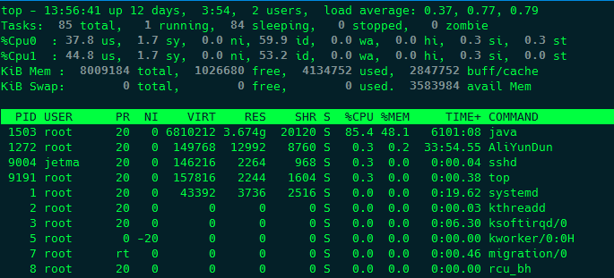
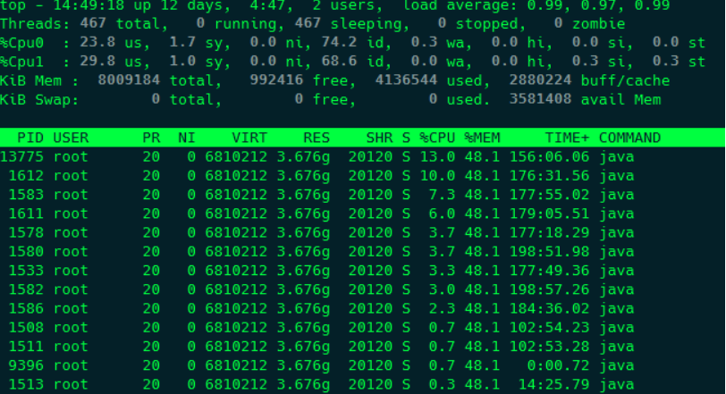
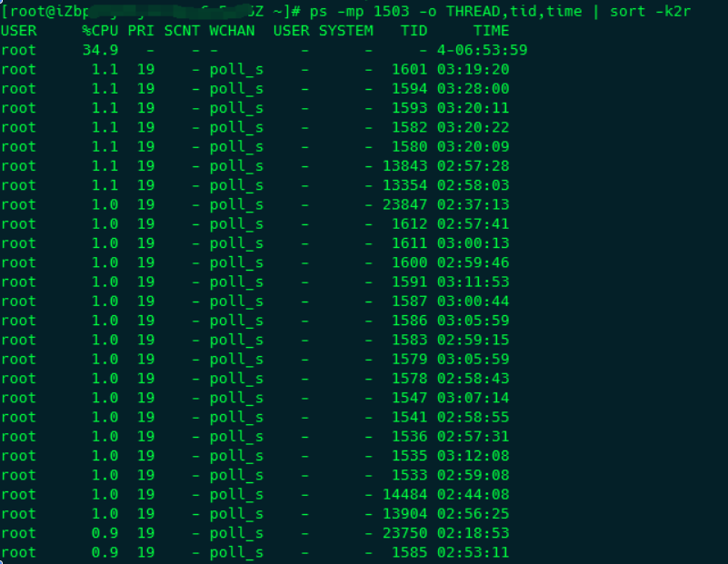
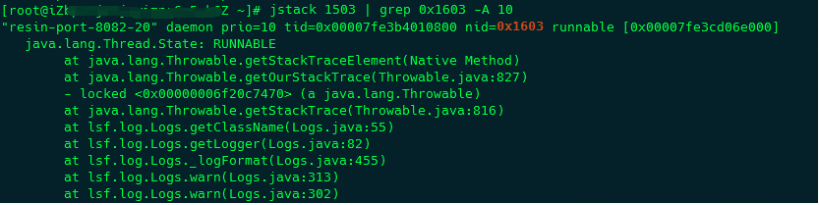

# JVM故障分析及性能优化系列之一：使用jstack定位线程堆栈信息(转载)

## **基本概念**

在对Java内存泄漏进行分析的时候，需要对jvm运行期间的内存占用、线程执行等情况进行记录的dump文件，常用的主要有thread dump和heap dump。

- **thread dump**:主要记录JVM在某一时刻各个线程执行的情况，以栈的形式显示，是一个文本文件。通过对thread dump文件可以分析出程序的问题出现在什么地方，从而定位具体的代码然后进行修正。thread dump需要结合占用系统资源的线程id进行分析才有意义。
- **heap dump**:主要记录了在某一时刻JVM堆中对象使用的情况，即某个时刻JVM堆的快照，是一个二进制文件，主要用于分析哪些对象占用了太对的堆空间，从而发现导致内存泄漏的对象。

上面两种dump文件都具有实时性，因此需要在服务器出现问题的时候生成，并且多生成几个文件，方便进行对比分析。下面我们先来说一下如何生成 thread dump。

<!-- more -->

## **使用jstack生成thread dump**

当服务器出现高CPU的时候，首先执行 

top -c 命令动态显示进程及占用资源的排行，如下图：

​    

top后面的参数

-c可以显示进程详细的信息。

top命令执行的时候还可以执行一些快捷键：

- 1:对于多核服务器，可以显示各个CPU占用资源的情况
- shift+h:显示所有的线程信息
- shift+w将当前top命令的设置保存到~/.toprc文件中，这样不用每次都执行快捷键了

以上图为例，pid为1503的进程占用了大量的CPU资源，接下来需要将占用CPU最高进程中的线程打印出来，可以用 

top -bn1 -H -p  命令，执行结果如下：

​    

上面 -bn1 参数的含义是只输出一次结果，而不是显示一个动态的结果。

我个人请喜欢用 ps -mp  -o THREAD,tid,time | sort -k2r 命令查看，后面的sort参数根据线程占用的cpu比例进行排序，结果如下：

​    

接下来我们清楚今天的主角 

jstack，这是一个在JDK5开始提供的内置工具，可以打印指定进程中线程运行的状态，包括线程数量、是否存在死锁、资源竞争情况和线程的状态等等。有下面的几个常用的参数：

- -l:长列表，打印关于锁的附加信息
- -m: 打印java和jni框架的所有栈信息

因为thread id在栈信息中是以十六进制的形式显示的，因此需要使用 

printf "%x \n"  命令将现场id转成十六进制的值，然后执行 

jstack -l  | grep  -A 10 命令显示出错的堆栈信息，如下图：

​    

上面命令中 -A 10 参数用来指定显示行数，否则只会显示一行信息。

这样通过上图，可以很快地定位到程序问题的代码，然后对代码进行分析和改进即可。**注意：需要在多个时间段提出多个 Thread Dump信息，然后综合进行对比分析，单独分析一个文件是没有意义的。**

## **生成shell文件**

上面讲述了整个的分析过程，不过所有的命令就是实时的，所以最好创建一个shell脚本瞬间执行完成，下面对 [当CPU飙高时，它在做什么](http://www.jianshu.com/p/90579ec3113f) 这篇文章中所提供的shell进行了改进如下：

```shell
#!/bin/bash
if [ $# -le 0 ]; then
    echo "usage: $0 <pid> [line-number]"
    exit 1
fi

# java home
if test -z $JAVA_HOME 
then
    JAVA_HOME='/usr/local/jdk'
fi

#pid
pid=$1
# checking pid
if test -z "$($JAVA_HOME/bin/jps -l | cut -d '' -f 1 | grep $pid)"
then
    echo "process of $pid is not exists"
    exit
fi

#line number
linenum=$2
if test -z $linenum
then
    linenum=10
fi

stackfile=stack$pid.dump
threadsfile=threads$pid.dump

# generate java stack
$JAVA_HOME/bin/jstack -l $pid >> $stackfile
ps -mp $pid -o THREAD,tid,time | sort -k2r | awk '{if ($1 !="USER" && $2 != "0.0" && $8 !="-") print $8;}' | xargs printf "%x\n" >> $threadsfile
tids="$(cat $threadsfile)"
for tid in $tids
do
    echo "------------------------------ ThreadId ($tid) ------------------------------"
    cat $stackfile | grep 0x$tid -A $linenum
done

rm -f $stackfile $threadsfile
```

