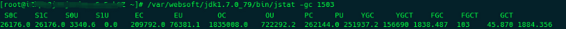
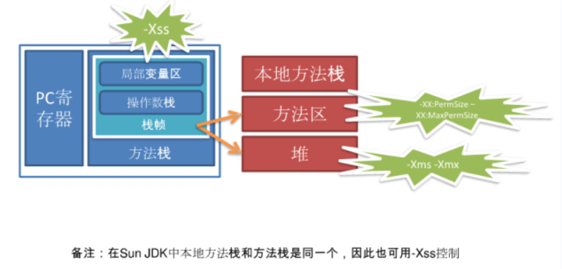

# JVM故障分析及性能优化系列之三：jstat命令的使用及VM Thread分析(转载)

## **使用jstat命令**

当服务器CPU100%的时候，通过定位占用资源最大的线程定位到 [VM Thread](http://www.javatang.com/archives/2017/10/19/51301886.html#VM_Thread)：

```shell
"VM Thread" prio=10 tid=0x00007fbea80d3800 nid=0x5e9 runnable
```

这个时候需要使用 jstat -gc    命令查看gc的信息，显示结果如下



```shell
S0C    S1C    S0U    S1U      EC       EU      OC         OU       PC        PU       YGC     YGCT    FGC   FGCT       GCT
64.0   64.0   0.0    0.0   332992.0   0.0    666304.0   73192.5   83968.0   83967.9   6893   17.576  6882   2705.923  2723.499
```

<!-- more -->

结果中每个项目的含义可以参考官方对[jstat](http://docs.oracle.com/javase/1.5.0/docs/tooldocs/share/jstat.html)的文档，简单翻译如下：

- S0C: Young Generation第一个survivor space的内存大小 (kB).
- S1C: Young Generation第二个survivor space的内存大小 (kB).
- S0U: Young Generation第一个Survivor space当前已使用的内存大小 (kB).
- S1U: Young Generation第二个Survivor space当前已经使用的内存大小 (kB).
- EC: Young Generation中eden space的内存大小 (kB).
- EU: Young Generation中Eden space当前已使用的内存大小 (kB).
- OC: Old Generation的内存大小 (kB).
- OU: Old Generation当前已使用的内存大小 (kB).
- PC: Permanent Generation的内存大小 (kB)
- PU: Permanent Generation当前已使用的内存大小 (kB).
- YGC: 从启动到采样时Young Generation GC的次数
- YGCT: 从启动到采样时Young Generation GC所用的时间 (s).
- FGC: 从启动到采样时Old Generation GC的次数.
- FGCT: 从启动到采样时Old Generation GC所用的时间 (s).
- GCT: 从启动到采样时GC所用的总时间 (s).

JDK8的结果稍微有所不同，结果含义可以参考：http://docs.oracle.com/javase/8/docs/technotes/tools/unix/jstat.html

## **JVM内存模型**

上面中的Young Generation、Permanent Generation和Old Generation等概念有一些混乱，这里简要的进行说明。简单来说，JVM内存由堆（Heap）和非堆（Non-heap）内存组成，前者共运行在JVM之上的程序使用，后者供JVM自己使用。

​    

堆内存的组成如下：

​    

非堆内存由 Permanent Generation 和 Code Cache 两部分组成：

- Permanent Generation（持久代）: 保存虚拟机自己的静态(refective)数据，主要存放加载的Class类级别静态对象如class本身，method，field等等。permanent generation空间不足会引发full GC；
- Code Cache: 用于编译和保存本地代码（native code）的内存，JVM内部处理或优化。

## **JVM内存参数设置**

**堆内存设置**

- 堆内存（总的）由 -Xms 和 -Xmx 分别设置最小和最大堆内存
- New Generation 由 -Xmn 设置，-XX:SurvivorRatio=m 设置 Eden和 两个Survivor区的大小比值；-XX:NewRatio=n 设置 New Generation 和 Old Generation 的大小比值。
- 每个线程的堆栈大小由 ·-Xss· 设置，JDK5.0以后每个线程堆栈大小为1M，以前每个线程堆栈大小为256K。在相同物理内存下，减小这个值能生成更多的线程。但是操作系统对一个进程内的线程数还是有限制的，不能无限生成，经验值在3000~5000左右。

**非堆内存设置**

非堆内存由` -XX:PermSize=n` 和` -XX:MaxPermSize=n `分别设置最小和最大非堆内存大小

**日志分析**

介绍完上面的概念之后，我们再来看最上面的日志信息，有两个地方有问题：一是FGC（完全GC）的数量太大了，正常来说FGC应该占整个GC（YGC+FGC）的1%到5%才正常，上面日志上完全GC的次数太多了；二是日志中PU的值太大了，基本上已经达到设置的PC了，因此需要增大MaxPermSize的值。不过这只是权宜之计，出现这么大的非堆内存，肯定什么地方出现了问题，还需要进一步找到占用内存的原因，这也是后面文章所要说的。
