# G1垃圾收集器(转载)

## **说明**

concurrent: 并发, 多个线程协同做同一件事情(有状态)

parallel: 并行, 多个线程各做各的事情(互相间无共享状态)

**在GC领域**: concurrent算法指GC线程和业务线程能并发执行； parallel指GC线程之间的并行。

参考: [What’s the difference between concurrency and parallelism](https://joearms.github.io/published/2013-04-05-concurrent-and-parallel-programming.html)

**概述**

## 目的

本文介绍如何使用G1,及在 Hotspot JVM 中怎么使用G1垃圾收集器。 您将了解 G1 收集器的内部原理, 切换为 G1 收集器的命令行参数, 以及让其记录GC日志的选项。

<!--more-->

## 简介

本文涵盖了Java虚拟机(JVM, Java Virtual Machine)中 G1 的基础知识。

1、第一部分, 简单概述JVM的同时介绍了垃圾收集和性能.2、接下来讲述了 Hotspot JVM 中 CMS 收集器是如何工作的.3、接着再一步一步地指导在 Hotspot JVM 中使用G1进行垃圾回收的工作方式.4、之后的一个小节介绍 G1 垃圾收集器可用的命令行参数.5、最后,您将了解如何配置使G1收集器记录日志.

硬件与软件环境需求

下面是 硬件与软件环境需求 清单:

- 一台PC机, 运行 Windows XP 以上操作系统, Mac OS X 或者 Linux 都可以. 注意,因为作者在Windows 7上进行开发和测试, 尚未在所有平台上完成测试。 但在 OS X和Linux 上应该也是正常的。最好配置了多核CPU.
- Java 7 Update 9 或更高版本
- 最新的 Java 7 Demos and Samples Zip 文件

准备条件

在开始学习本教程之前, 你需要:

- 下载并安装最新的 Java JDK (JDK 7 u9 或 以后的版本):
- Java 7 JDK 下载页面
- 下载并安装 Demos and Samples (示例与样例) zip 文件, 下载页面和JDK相同. 然后解压到合适的位置. 如:
- C:\javademos

## **Java 技术 和 JVM**

### **Java 概述**

Java 是 Sun Microsystems 公司在1995年发布的一门编程语言. 同时也是一个运行Java程序的底层平台. 提供工具、游戏和企业应用程序支持。Java 运行在全世界超过8.5亿的PC,以及数十亿的智能设备上,包括 mobile 和 TV. Java 是由许多关键部件组成的一个整体, 统称为Java平台。

JRE(Java Runtime Edition)

一般来说下载了Java以后, 你就得到了一个Java运行时: Java Runtime Environment (JRE). JRE 由Java虚拟机 Java Virtual Machine (JVM), Java 平台核心类(core classes), 以及 Java平台支持库组成. 必须有这三大组件的支持才能在你的电脑上运行 Java 程序. 例如 Java 7, 可以在操作系统上作为桌面应用程序运行, 还可以通过 Java Web Start 从Web上安装, 或者是作为嵌入式Web程序在浏览器中运行 (通过 JavaFX).

Java 编程语言

Java 是一门面向对象编程语言(object-oriented programming language), 包涵以下特性.

- Platform Independence – Java 应用程序被编译为字节码(bytecode)存放到 class 文件中, 由JVM加载. 因为程序在 JVM 中运行, 所以可以跨平台运行在各种操作系统/设备上.
- Object-Oriented – Java 是一门面向对象的语言, 继承了 C 和 C++ 的很多特性,并在此基础上进行扩充和优化.
- Automatic Garbage Collection – Java对内存进行 自动分配(allocates) 和自动释放(deallocates). 所以程序不再执行这一繁琐的任务(其实自动内存回收,更多的好处是减少了编程需要重复处理的这种细节,另一个例子是对JDBC的封装).
- Rich Standard Library – Java包含大量的标准对象,可以执行诸如输入输出(input/output), 网络操作以及日期处理等任务.

JDK(Java Development Kit)

JDK 是用来开发Java程序的一系列工具集. 通过JDK, 你可以编译用Java语言书写的程序, 并在 JVM 中运行. 另外, JDK 还提供了打包(packaging)和分发(distributing)程序的工具.

JDK 和 JRE 使用同样的 Java Application Programming Interfaces ([Java API](http://docs.oracle.com/javase/7/docs/api/)).Java API 是预先打包好以供程序员用来开发程序的类库集合. 通过 Java API 使得很多常规任务可以很轻松的就完成,如 字符串操作(string manipulation), 时间日期处理(date/time processing), 网络编程(networking), 以及实现各种数据结构(data structures, 如 lists, maps, stacks, and queues).

JVM(Java Virtual Machine)

Java Virtual Machine (JVM) 是一台抽象的计算机(abstract computing machine). JVM 本质是一个程序, 但在运行于JVM上的程序看来, 他就像一台真实机器一样. 这样, Java程序就能使用相同的接口和库. 每种特定操作系统上的 JVM 实现, 都将 Java 程序指令转换为本地机器的指令(instructions)和命令(commands). 由此,实现了Java程序的平台独立性.

Java虚拟机的第一个原型实现,由 Sun Microsystems, Inc. 完成, 在一台手持设备上用软件模拟了 Java虚拟机指令集, 类似于今天的 PDA(Personal Digital Assistant). Oracle 当前在移动设备,桌面系统和服务器上都提供了Java虚拟机实现, 但Java虚拟机不限制使用任何特定的技术,硬件,或操作系统。JVM也不一定都是基于软件的,你可以直接在硬件CPU上实现JVM指令, 还可以芯片上实现,或者采用 microcode 的方式来实现.

Java 虚拟机完全不关心Java语言的细节, 只识别 class 文件这种特定的二进制格式. 一个 class 文件包含 Java虚拟机指令(或称之为字节码 bytecode) 及符号变量表(symbol table), 还有一些辅助信息.

基于安全性考虑, Java虚拟机对 class 文件中的代码执行 强语法检查和组成结构规范限制. 既然虚拟机有这种特征, 那么任何一门编程语言,只要能编译为合法的 class 文件，都可以加载到 Java虚拟机 里面执行。由于具有通用性,跨平台特性, 其他语言的实现者可以把Java虚拟机作为该语言的加载执行工具。(1) [The Java Virtual Machine](http://docs.oracle.com/javase/specs/jvms/se7/html/jvms-1.html)

### **探索 JVM 体系架构**

Hotspot 架构

HotSpot JVM 有一个稳定强悍的架构, 支持强大的功能与特性, 具备实现高性能和大规模可伸缩性的能力。例如,HotSpot JVM JIT编译器能动态进行优化生成。换句话说,他们运行Java程序时,会针对底层系统架构动态生成高性能的本地机器指令。此外,通过成熟的演进和运行时环境的持续工程,加上多线程垃圾收集器,HotSpot JVM即使实在大型计算机系统上也能获得很高的伸缩性.

​    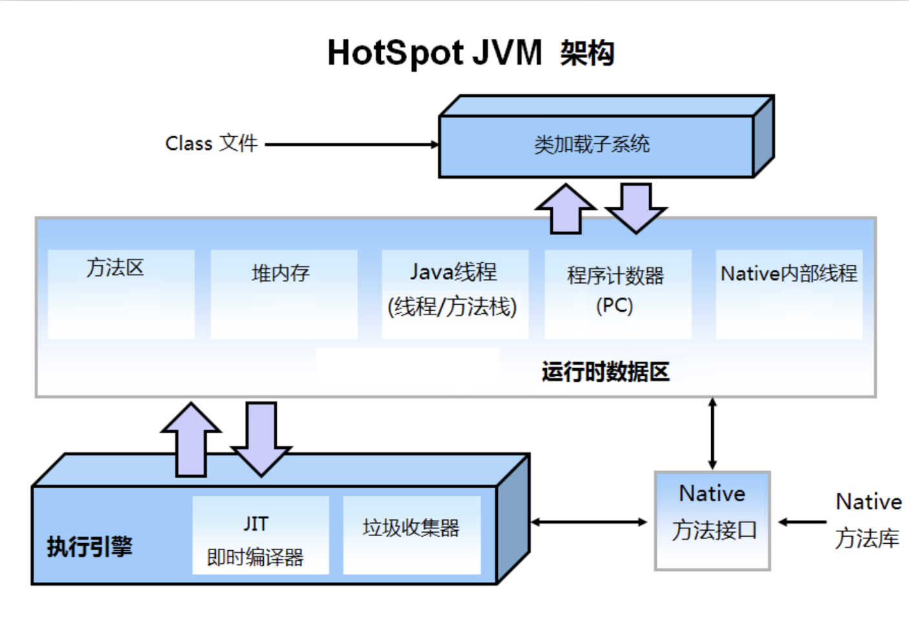

JVM 的主要组件包括: 类加载器(class loader), 运行时数据区(runtime data areas), 以及执行引擎(execution engine).

Hotspot 关键部分

与性能(performance)有关的部分是 JVM 最重要的组件,下图中用高亮的颜色来显示.

​    

对JVM进行性能调优时有三大组件需要重点关注。堆(Heap)是存放对象的内存空间。这个区域由JVM启动时选择的垃圾收集器进行管理。大多数调优参数都是调整堆内存的大小,以及根据实际情况选择最合适的垃圾收集器. JIT编译器也对性能有很大的影响, 但新版本的JVM调优中很少需要关注.

### **性能基础**

大多数情况下对 Java 程序进行调优, 主要关注两个目标之一: **响应速度(responsiveness)** 和/或 **吞吐量(throughput)**. 下面的教程中我们将讲述这些概念.

响应能力(Responsiveness)

响应能力就是程序或系统对一个请求的响应有多迅速. 比如:

- 程序UI响应速度有多灵敏
- 网站页面响应有多快
- 数据库查询有多快

对响应速度要求很高的系统, 较大的停顿时间(large pause times) 是不可接受的. 重点是在非常短的时间周期内快速响应.

吞吐量(Throughput)

吞吐量关注在一个特定时间段内应用系统的最大工作量。衡量吞吐量的指标/示例包括:

- 给定时间内完成的事务数.
- 每小时批处理系统能完成的作业(jobs)数量.
- 每小时能完成多少次数据库查询

在吞吐量方面优化的系统, 停顿时间长(High pause times)也是可以接受的。由于高吞吐量应用运行时间长,所以此时更关心的是如何尽可能快地完成整个任务，而不考虑快速响应。

## **G1 垃圾收集器(Garbage Collector)**

### **G1 垃圾收集器**

G1 (Garbage-First)是一款面向服务器的垃圾收集器,主要针对配备多颗处理器及大容量内存的机器. 以极高概率满足GC停顿时间要求的同时,还具备高吞吐量性能特征. 在Oracle JDK 7 update 4 及以上版本中得到完全支持, 专为以下应用程序设计:

- 可以像CMS收集器一样,GC操作与应用的线程一起并发执行
- 紧凑的空闲内存区间且没有很长的GC停顿时间.
- 需要可预测的GC暂停耗时.
- 不想牺牲太多吞吐量性能.
- 启动后不需要请求更大的Java堆.

G1的长期目标是取代CMS(Concurrent Mark-Sweep Collector, 并发标记-清除). 因为特性的不同使G1成为比CMS更好的解决方案. 一个区别是,G1是一款压缩型的收集器.G1通过有效的压缩完全避免了对细微空闲内存空间的分配,不用依赖于regions，这不仅大大简化了收集器，而且还消除了潜在的内存碎片问题。除压缩以外，G1的垃圾收集停顿也比CMS容易估计，也允许用户自定义所希望的停顿参数(pause targets)

G1 操作概述

上一代的垃圾收集器(串行serial, 并行parallel, 以及CMS)都把堆内存划分为固定大小的三个部分: 年轻代(young generation), 年老代(old generation), 以及持久代(permanent generation).

​    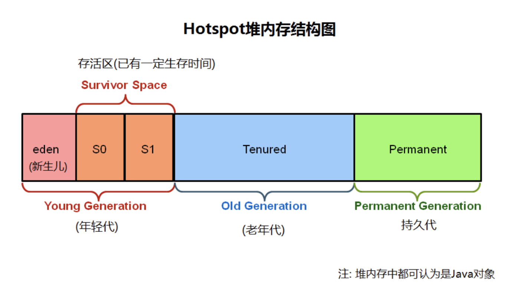

内存中的每个对象都存放在这三个区域中的一个.

而 G1 收集器采用一种不同的方式来管理堆内存.

​    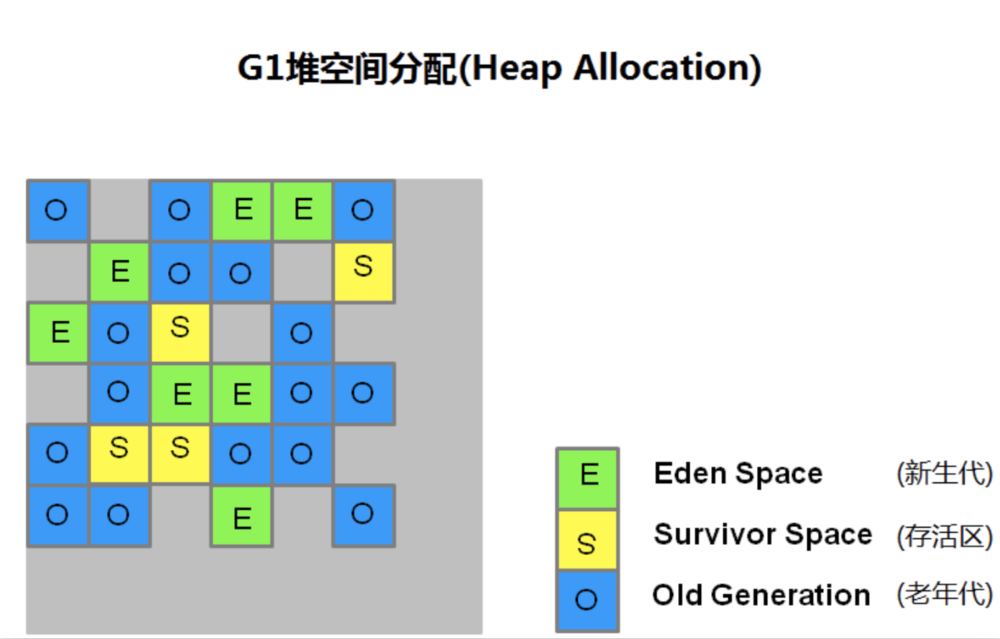

堆内存被划分为多个大小相等的 heap 区,每个heap区都是逻辑上连续的一段内存(virtual memory). 其中一部分区域被当成老一代收集器相同的角色(eden, survivor, old), 但每个角色的区域个数都不是固定的。这在内存使用上提供了更多的灵活性。

G1执行垃圾回收的处理方式与CMS相似. G1在全局标记阶段(global marking phase)并发执行, 以确定堆内存中哪些对象是存活的。标记阶段完成后,G1就可以知道哪些heap区的empty空间最大。它会首先回收这些区,通常会得到大量的自由空间. 这也是为什么这种垃圾收集方法叫做Garbage-First(垃圾优先)的原因。顾名思义, G1将精力集中放在可能布满可收回对象的区域, 可回收对象(reclaimable objects)也就是所谓的垃圾. G1使用暂停预测模型(pause prediction model)来达到用户定义的目标暂停时间,并根据目标暂停时间来选择此次进行垃圾回收的heap区域数量.

被G1标记为适合回收的heap区将使用转移(evacuation)的方式进行垃圾回收. G1将一个或多个heap区域中的对象拷贝到其他的单个区域中,并在此过程中压缩和释放内存. 在多核CPU上转移是并行执行的(parallel on multi-processors), 这样能减少停顿时间并增加吞吐量. 因此,每次垃圾收集时, G1都会持续不断地减少碎片, 并且在用户给定的暂停时间内执行. 这比以前的方法强大了很多. CMS垃圾收集器(Concurrent Mark Sweep,并发标记清理)不进行压缩. ParallelOld 垃圾收集只对整个堆执行压缩,从而导致相当长的暂停时间。

需要强调的是, G1并不是一款实时垃圾收集器(real-time collector). 能以极高的概率在设定的目标暂停时间内完成,但不保证绝对在这个时间内完成。 基于以前收集的各种监控数据, G1会根据用户指定的目标时间来预估能回收多少个heap区. 因此,收集器有一个相当精确的heap区耗时计算模型,并根据该模型来确定在给定时间内去回收哪些heap区.

注意 G1分为两个阶段: 并发阶段(concurrent, 与应用线程一起运行, 如: 细化 refinement、标记 marking、清理 cleanup) 和 并行阶段(parallel, 多线程执行, 如: 停止所有JVM线程, stop the world). 而 FullGC(完整垃圾收集)仍然是单线程的, 但如果进行适当的调优,则应用程序应该能够避免 full GC。

G1 的内存占用(Footprint)

如果从 ParallelOldGC 或者 CMS收集器迁移到 G1, 您可能会看到JVM进程占用更多的内存(a larger JVM process size). 这在很大程度上与 “accounting” 数据结构有关, 如 Remembered Sets 和 Collection Sets.

Remembered Sets 简称 RSets, 跟踪指向某个heap区内的对象引用. 堆内存中的每个区都有一个 RSet. RSet 使heap区能并行独立地进行垃圾集合. RSets的总体影响小于5%.

Collection Sets 简称 CSets, 收集集合, 在一次GC中将执行垃圾回收的heap区. GC时在CSet中的所有存活数据(live data)都会被转移(复制/移动). 集合中的heap区可以是 Eden, survivor, 和/或 old generation. CSets所占用的JVM内存小于1%.

推荐使用 G1 的场景(Recommended Use Cases)

G1的首要目标是为需要大量内存的系统提供一个保证GC低延迟的解决方案. 也就是说堆内存在6GB及以上,稳定和可预测的暂停时间小于0.5秒.

如果应用程序具有如下的一个或多个特征,那么将垃圾收集器从CMS或ParallelOldGC切换到G1将会大大提升性能.

- Full GC 次数太频繁或者消耗时间太长.
- 对象分配的频率或代数提升(promotion)显著变化.
- 受够了太长的垃圾回收或内存整理时间(超过0.5~1秒)

注意: 如果正在使用CMS或ParallelOldGC,而应用程序的垃圾收集停顿时间并不长,那么继续使用现在的垃圾收集器是个好主意. 使用最新的JDK时并不要求切换到G1收集器。

## **CMS的GC概述**

### **分代GC(Generational GC)与 CMS**

并发标记清理(CMS, Concurrent Mark Sweep)收集器(也称为多并发低暂停的收集器)回收老年代内存(tenured generation). 它将垃圾回收中的绝大部分工作与应用程序的线程一起并发执行,以期能最小化暂停时间. 通常多并发低暂停收集器收集器不复制或也不压缩存活的对象. 垃圾回收不移动存活的对象, 如果产生内存碎片问题,就会分配/占用更大的堆内存空间。

注意: 年轻代使用的CMS收集器也和并行收集器采用一样的算法.

CMS 垃圾收集阶段划分(Collection Phases)

CMS收集器在老年代堆内存的回收中执行分为以下阶段:

| 阶段                              | 说明                                                         |
| --------------------------------- | ------------------------------------------------------------ |
| (1) 初始标记 (Initial Mark)       | (Stop the World Event,所有应用线程暂停) 在老年代(old generation)中的对象, 如果从年轻代(young generation)中能访问到, 则被 “标记,marked” 为可达的(reachable).对象在旧一代“标志”可以包括这些对象可能可以从年轻一代。暂停时间一般持续时间较短,相对小的收集暂停时间. |
| (2) 并发标记 (Concurrent Marking) | 在Java应用程序线程运行的同时遍历老年代(tenured generation)的可达对象图。扫描从被标记的对象开始,直到遍历完从root可达的所有对象. 调整器(mutators)在并发阶段的2、3、5阶段执行,在这些阶段中新分配的所有对象(包括被提升的对象)都立刻标记为存活状态. |
| (3) 再次标记(Remark)              | (Stop the World Event, 所有应用线程暂停) 查找在并发标记阶段漏过的对象，这些对象是在并发收集器完成对象跟踪之后由应用线程更新的. |
| (4) 并发清理(Concurrent Sweep)    | 回收在标记阶段(marking phases)确定为不可及的对象. 死对象的回收将此对象占用的空间增加到一个空闲列表(free list),供以后的分配使用。死对象的合并可能在此时发生. 请注意,存活的对象并没有被移动. |
| (5) 重置(Resetting)               | 清理数据结构,为下一个并发收集做准备.                         |

CMS的GC步骤

接下来,让我们一步步地讲述CMS收集器的操作.

1、 CMS的堆内存结构(Heap Structure)

堆内存被分为3个空间.

​    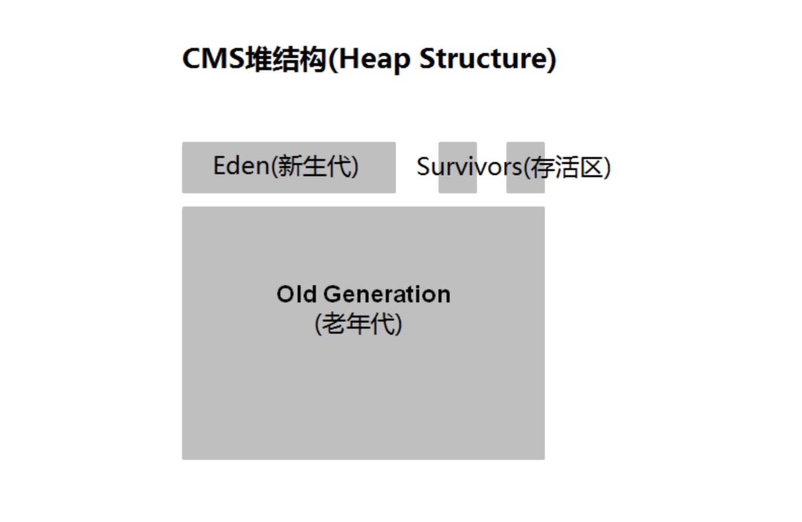

年轻代(Young generation)分为 1个新生代空间(Eden)和2个存活区(survivor spaces). 老年代(Old generation)是一大块连续的空间, 垃圾回收(Object collection)就地解决(is done in place), 除了 Full GC, 否则不会进行压缩(compaction).

2、 CMS年轻代(Young) GC 的工作方式

年轻代(young generation)用高亮的绿色表示, 老年代(old generation)用蓝色表示。如果程序运行了一段时间,那么 CMS 看起来就像下图这个样子. 对象散落在老年代中的各处地方.

​    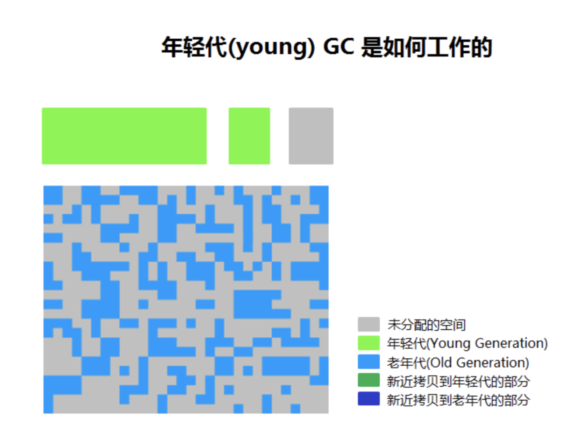

在使用 CMS 时, 老年代的对象回收就地进行(deallocated in place). 他们不会被移动到其他地方. 除了 Full GC, 否则内存空间不会进行压缩.

3、 年轻代垃圾回收(Young Generation Collection)

Eden区和survivor区中的存活对象被拷贝到另一个空的survivor 区. 存活时间更长,达到阀值的对象会被提升到老年代(promoted to old generation).

​    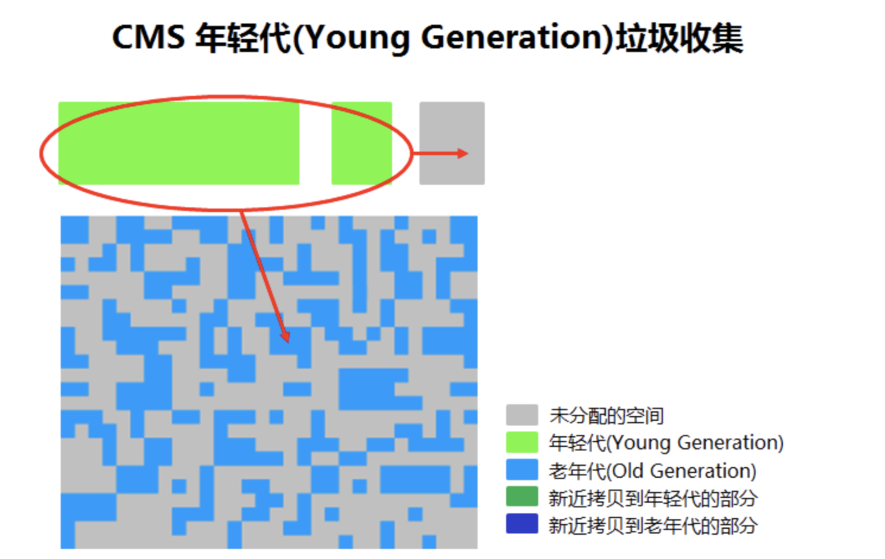

4、 年轻代(Young) GC 之后

年轻代(Young)进行一次垃圾回收之后, Eden 区被清理干净(cleared),两个 survivor 区中的一个也被清理干净了. 如下图所示:

​    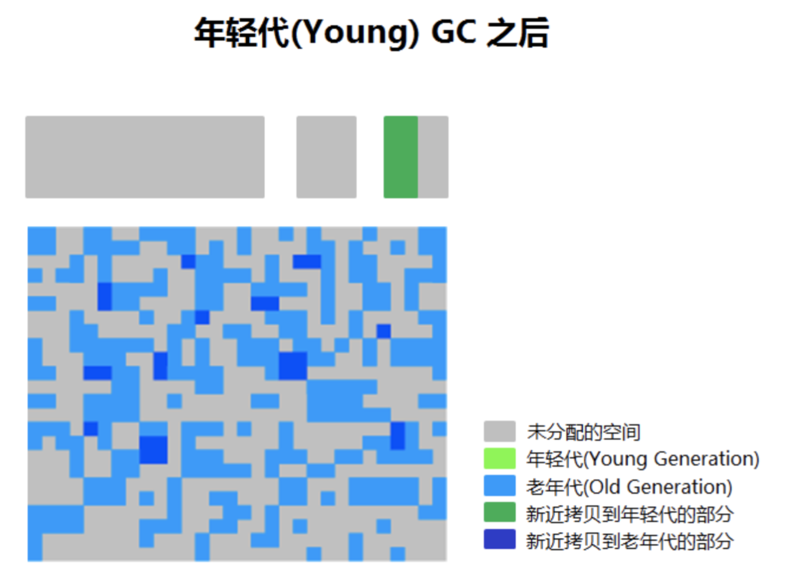

图中新提升的对象用深蓝色来标识. 绿色的部分是年轻代中存活的对象,但还没被提升到老年代中.

5、 CMS的老年代回收(Old Generation Collection)

两次stop the world事件发生在: 初始标记(initial mark)以及重新标记(remark)阶段. 当老年代达到一定的占有率时,CMS垃圾回收器就开始工作.

​    

(1) 初始标记(Initial mark)阶段的停顿时间很短,在此阶段存活的(live,reachable,可及的) 对象被记下来. (2) 并发标记(Concurrent marking)在程序继续运行的同时找出存活的对象. 最后, 在第(3)阶段(remark phase), 查找在第(2)阶段(concurrent marking)中错过的对象.

6、 老年代回收 – 并发清理(Concurrent Sweep)

在前面阶段未被标记的对象将会就地释放(deallocated in place). 此处没有压缩(compaction).

​    

备注: 未标记(Unmarked)的对象 == 已死对象(Dead Objects)

7、 老年代回收 – 清理之后(After Sweeping)

在第(4)步(Sweeping phase)之后, 可以看到很多内存被释放了. 还应该注意到,这里并没有执行内存压缩整理(no compaction).

​    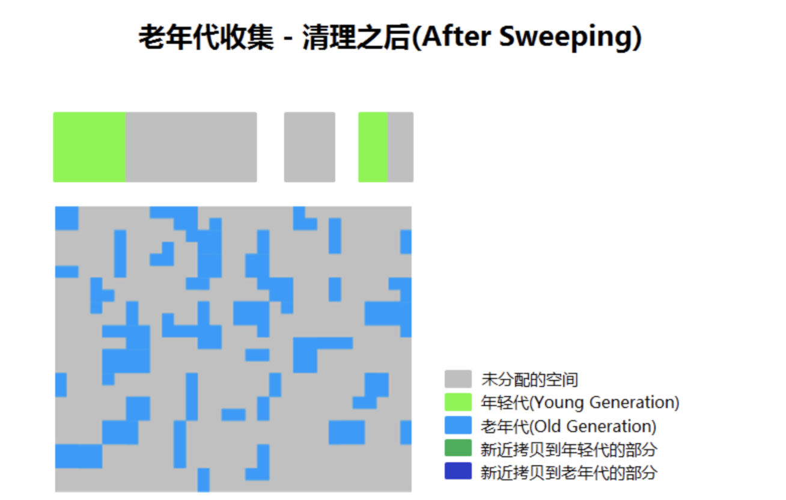

最后, CMS 收集器进入(move through)第(5)阶段, 重置(resetting phase), 然后等候下一次的GC阀值到来(GC threshold).

## **G1垃圾收集器概述**

### **一步步介绍G1**

G1收集器采用一种不同的方式来分配堆. 下面通过图解的方式一步步地讲述G1系统.

1、 G1的堆内存结构

堆内存被划分为固定大小的多个区域.

​    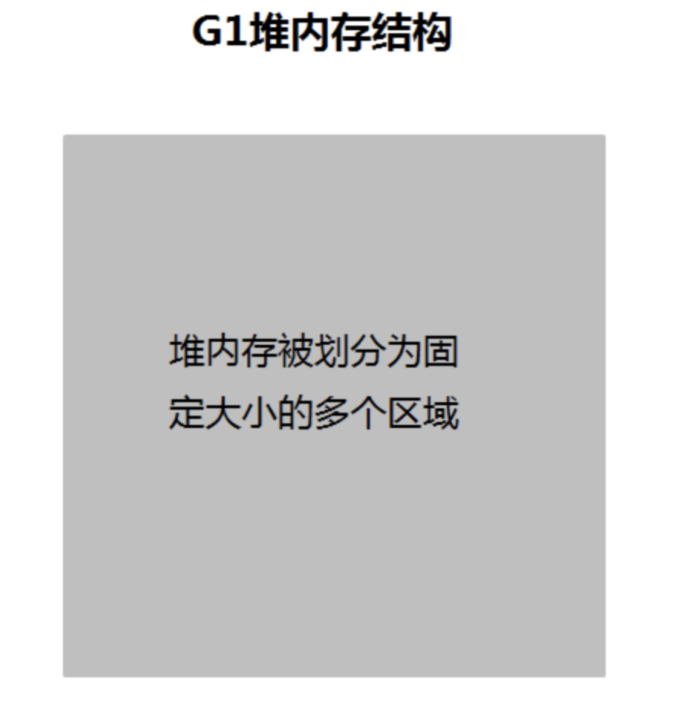

每个heap区(Region)的大小在JVM启动时就确定了. JVM 通常生成 2000 个左右的heap区, 根据堆内存的总大小,区的size范围允许为 1Mb 到 32Mb.

2、 G1 堆空间分配

实际上,这些区域(regions)被映射为逻辑上的 Eden, Survivor, 和 old generation(老年代)空间.

​    

图中的颜色标识了每一个区域属于哪个角色. 存活的对象从一块区域转移(复制或移动)到另一块区域。设计成 heap 区的目的是为了并行地进行垃圾回收(的同时停止/或不停止其他应用程序线程).

如图所示,heap区可以分配为 Eden, Survivor, 或 old generation(老年代)区. 此外,还有第四种类型的对象被称为巨无霸区域(Humongous regions),这种巨无霸区是设计了用来保存比**标准块**(standard region)大50%及以上的对象, 它们存储在一组连续的区中. 最后一个类型是堆内存中的未使用区(unused areas).

备注: 截止英文原文发表时,巨无霸对象的回收还没有得到优化. 因此,您应该尽量避免创建太大(大于32MB?)的对象.

3、 G1中的年轻代(Young Generation)

堆被分为大约2000个区. 最小size为1 Mb, 最大size为 32Mb. 蓝色的区保存老年代对象,绿色区域保存年轻代对象.

​    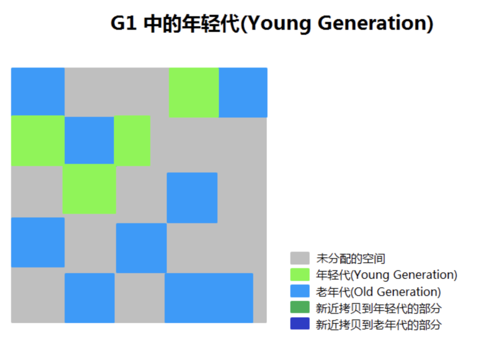

注意G1中各代的heap区不像老一代垃圾收集器一样要求各部分是连续的.

4、 G1中的一次年轻代GC

存活的对象被转移(copied or moved)到一个/或多个存活区(survivor regions). 如果存活时间达到阀值,这部分对象就会被提升到老年代(promoted to old generation regions).

​    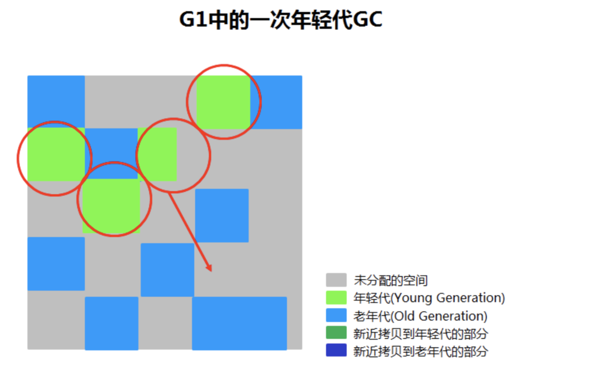

此时会有一次 stop the world(STW)暂停. 会计算出 Eden大小和 survivor 大小,给下一次年轻代GC使用. 清单统计信息(Accounting)保存了用来辅助计算size. 诸如暂停时间目标之类的东西也会纳入考虑.

这种方法使得调整各代区域的尺寸很容易, 让其更大或更小一些以满足需要.

5、 G1的一次年轻代GC完成后

存活对象被转移到存活区(survivor regions) 或 老年代(old generation regions).

​    

刚刚被提升上来的对象用深绿色显示. Survivor 区用绿色表示.

总结起来,G1的年轻代收集归纳如下:

- 堆一整块内存空间,被分为多个heap区(regions).
- 年轻代内存由一组不连续的heap区组成. 这使得在需要时很容易进行容量调整.
- 年轻代的垃圾收集,或者叫 young GCs, 会有 stop the world 事件. 在操作时所有的应用程序线程都会被暂停(stopped).
- 年轻代 GC 通过多线程并行进行.
- 存活的对象被拷贝到新的 survivor 区或者老年代.

### **Old Generation Collection with G1**

和 CMS 收集器相似, G1 收集器也被设计为用来对老年代的对象进行低延迟(low pause)的垃圾收集. 下表描述了G1收集器在老年代进行垃圾回收的各个阶段.

G1 收集阶段 – 并发标记周期阶段(Concurrent Marking Cycle Phases)

G1 收集器在老年代堆内存中执行下面的这些阶段. 注意有些阶段也是年轻代垃圾收集的一部分.

| 阶段                                 | 说明                                                         |
| ------------------------------------ | ------------------------------------------------------------ |
| (1) 初始标记(Initial Mark)           | (Stop the World Event,所有应用线程暂停) 此时会有一次 stop the world(STW)暂停事件. 在G1中, 这附加在(piggybacked on)一次正常的年轻代GC. 标记可能有引用指向老年代对象的survivor区(根regions). |
| (2) 扫描根区域(Root Region Scanning) | 扫描 survivor 区中引用到老年代的引用. 这个阶段应用程序的线程会继续运行. 在年轻代GC可能发生之前此阶段必须完成. |
| (3) 并发标记(Concurrent Marking)     | 在整个堆中查找活着的对象. 此阶段应用程序的线程正在运行. 此阶段可以被年轻代GC打断(interrupted). |
| (4) 再次标记(Remark)                 | (Stop the World Event,所有应用线程暂停) 完成堆内存中存活对象的标记. 使用一个叫做 snapshot-at-the-beginning(SATB, 起始快照)的算法, 该算法比CMS所使用的算法要快速的多. |
| (5) 清理(Cleanup)                    | (Stop the World Event,所有应用线程暂停,并发执行)在存活对象和完全空闲的区域上执行统计(accounting). (Stop the world)擦写 Remembered Sets. (Stop the world)重置空heap区并将他们返还给空闲列表(free list). (Concurrent, 并发) |
| (*) 拷贝(Copying)                    | (Stop the World Event,所有应用线程暂停) 产生STW事件来转移或拷贝存活的对象到新的未使用的heap区(new unused regions). 只在年轻代发生时日志会记录为 `[GC pause (young)]`. 如果在年轻代和老年代一起执行则会被日志记录为 `[GC Pause (mixed)]`. |

G1老年代收集步骤

顺着定义的阶段,让我们看看G1收集器如何处理老年代(old generation).

6、 初始标记阶段(Initial Marking Phase)

存活对象的初始标记被固定在年轻代垃圾收集里面. 在日志中被记为 GC pause (young)(inital-mark)。

​    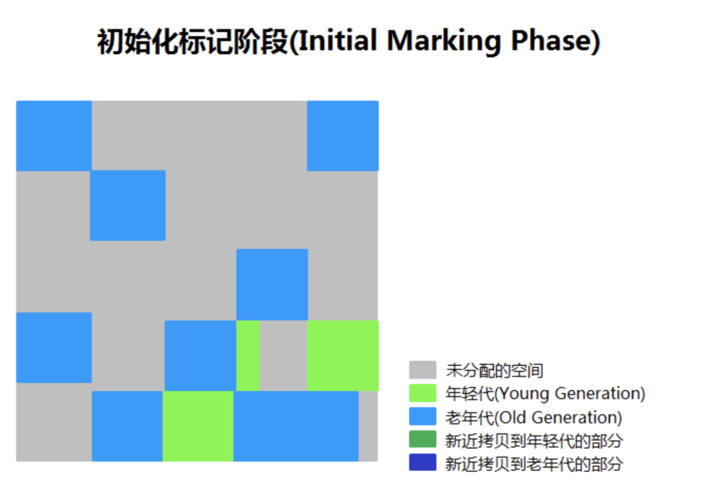

7、 并发标记阶段(Concurrent Marking Phase)

如果找到空的区域(如用红叉“X”标示的区域), 则会在 Remark 阶段立即移除. 当然,”清单(accounting)”信息决定了活跃度(liveness)的计算.

​    

8、 再次标记阶段(Remark Phase)

空的区域被移除并回收。现在计算所有区域的活跃度(Region liveness).

​    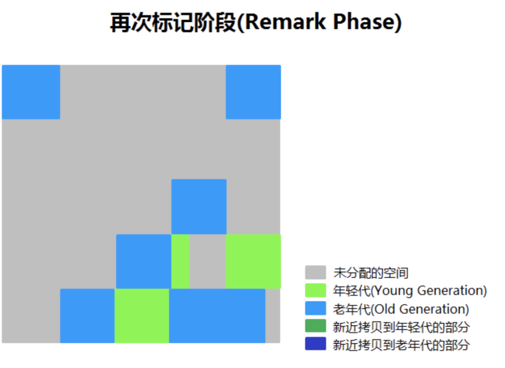

9、 拷贝/清理阶段(Copying/Cleanup)

G1选择“活跃度(liveness)”最低的区域, 这些区域可以最快的完成回收. 然后这些区域和年轻代GC在同时被垃圾收集 . 在日志被标识为 [GC pause (mixed)]. 所以年轻代和老年代都在同一时间被垃圾收集.

​    

10、拷贝/清理之后(After Copying/Cleanup)

所选择的区域被收集和压缩到下图所示的深蓝色区域和深绿色区域.

​    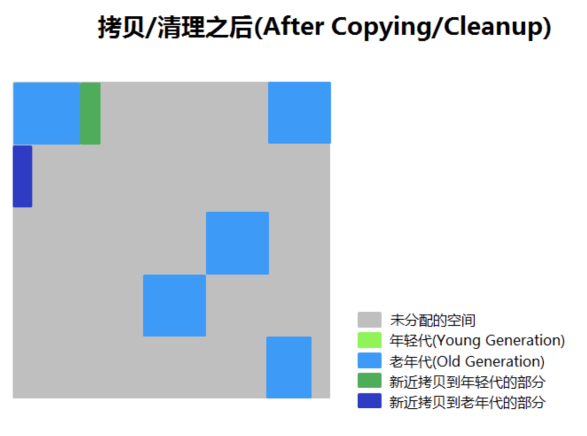

老年代GC(Old Generation GC)总结

总结下来,G1对老年代的GC有如下几个关键点:

- 并发标记清理阶段(Concurrent Marking Phase)

- - 活跃度信息在程序运行的时候被并行计算出来
  - 活跃度(liveness)信息标识出哪些区域在转移暂停期间最适合回收.
  - 不像CMS一样有清理阶段(sweeping phase).

- 再次标记阶段(Remark Phase)

- - 使用的 Snapshot-at-the-Beginning (SATB, 开始快照) 算法比起 CMS所用的算法要快得多.
  - 完全空的区域直接被回收.

- 拷贝/清理阶段(Copying/Cleanup Phase)

- - 年轻代与老年代同时进行回收.
  - 老年代的选择基于其活跃度(liveness).

## **命令行参数与最佳实践**

### **命令行参数与最佳实践**

在本节中,让我们看看G1的各种命令行选项.

命令行基本参数

要启用 G1 收集器请使用: -XX:+UseG1GC

下面是启动 Java2Demo示例程序的命令行示例. Java2Demo位于下载 JDK demos and samples 后解压的文件夹中:

java -Xmx50m -Xms50m -XX:+UseG1GC -XX:MaxGCPauseMillis=200 -jar c:\javademos\demo\jfc\Java2D\Java2demo.jar

关键命令行开关

-XX:+UseG1GC – 让 JVM 使用 G1 垃圾收集器.

-XX:MaxGCPauseMillis=200 – 设置最大GC停顿时间(GC pause time)指标(target). 这是一个软性指标(soft goal), JVM 会尽力去达成这个目标. 所以有时候这个目标并不能达成. 默认值为 200 毫秒.

-XX:InitiatingHeapOccupancyPercent=45 – 启动并发GC时的堆内存占用百分比. G1用它来触发并发GC周期,基于整个堆的使用率,而不只是某一代内存的使用比例。值为 0 则表示“一直执行GC循环)’. 默认值为 45 (例如, 全部的 45% 或者使用了45%).

最佳实践

在使用 G1 作为垃圾收集器时,你应该遵循下面这些最佳实践的指导.

不要设置年轻代的大小(Young Generation Size)

假若通过 -Xmn 显式地指定了年轻代的大小, 则会干扰到 G1收集器的默认行为.

- G1在垃圾收集时将不再关心暂停时间指标. 所以从本质上说,设置年轻代的大小将禁用暂停时间目标.
- G1在必要时也不能够增加或者缩小年轻代的空间. 因为大小是固定的,所以对更改大小无能为力.

响应时间指标(Response Time Metrics)

设置 XX:MaxGCPauseMillis= 时不应该使用平均响应时间(ART, average response time) 作为指标,而应该考虑使用目标时间的90%或者更大作为响应时间指标. 也就是说90%的用户(客户端/?)请求响应时间不会超过预设的目标值. 记住,暂停时间只是一个目标,并不能保证总是得到满足.

什么是转移失败(Evacuation Failure)?

对 survivors 或 promoted objects 进行GC时如果JVM的heap区不足就会发生提升失败(promotion failure). 堆内存不能继续扩充,因为已经达到最大值了. 当使用 -XX:+PrintGCDetails 时将会在GC日志中显示 to-space overflow (to-空间溢出)。

这是很昂贵的操作!

- GC仍继续所以空间必须被释放.
- 拷贝失败的对象必须被放到正确的位置(tenured in place).
- CSet指向区域中的任何 RSets 更新都必须重新生成(regenerated).
- 所有这些步骤都是代价高昂的.

如何避免转移失败(Evacuation Failure)

要避免避免转移失败, 考虑采纳下列选项.

- 增加堆内存大小

- - 增加 -XX:G1ReservePercent=n, 其默认值是 10.
  - G1创建了一个假天花板(false ceiling),在需要更大 ‘to-space’ 的情况下会尝试从保留内存获取(leave the reserve memory free).

- 更早启动标记周期(marking cycle)

- 通过采用 -XX:ConcGCThreads=n 选项增加标记线程(marking threads)的数量.

G1 的 GC 参数完全列表

下面是完整的 G1 的 GC 开关参数列表. 在使用时请记住上面所述的最佳实践.

| 选项/默认值                          | 说明                                                         |
| ------------------------------------ | ------------------------------------------------------------ |
| -XX:+UseG1GC                         | 使用 G1 (Garbage First) 垃圾收集器                           |
| -XX:MaxGCPauseMillis=n               | 设置最大GC停顿时间(GC pause time)指标(target). 这是一个软性指标(soft goal), JVM 会尽量去达成这个目标. |
| -XX:InitiatingHeapOccupancyPercent=n | 启动并发GC周期时的堆内存占用百分比. G1之类的垃圾收集器用它来触发并发GC周期,基于整个堆的使用率,而不只是某一代内存的使用比. 值为 0 则表示”一直执行GC循环”. 默认值为 45. |
| -XX:NewRatio=n                       | 新生代与老生代(new/old generation)的大小比例(Ratio). 默认值为 2. |
| -XX:SurvivorRatio=n                  | eden/survivor 空间大小的比例(Ratio). 默认值为 8.             |
| -XX:MaxTenuringThreshold=n           | 提升年老代的最大临界值(tenuring threshold). 默认值为 15.     |
| -XX:ParallelGCThreads=n              | 设置垃圾收集器在并行阶段使用的线程数,默认值随JVM运行的平台不同而不同. |
| -XX:ConcGCThreads=n                  | 并发垃圾收集器使用的线程数量. 默认值随JVM运行的平台不同而不同. |
| -XX:G1ReservePercent=n               | 设置堆内存保留为假天花板的总量,以降低提升失败的可能性. 默认值是 10. |
| -XX:G1HeapRegionSize=n               | 使用G1时Java堆会被分为大小统一的的区(region)。此参数可以指定每个heap区的大小. 默认值将根据 heap size 算出最优解. 最小值为 1Mb, 最大值为 32Mb. |

## **记录G1的GC日志**

### **记录G1的GC日志**

我们要介绍的最后一个主题是使用日志信息来分享G1收集器的性能. 本节简要介绍垃圾收集的相关参数,以及日志中打印的相关信息.

设置日志细节(Log Detail)

可以设置3种不同的日志级别.

(1) -verbosegc (等价于 -XX:+PrintGC) 设置日志级别为 好 fine.

日志输出示例

```log
[GC pause (G1 Humongous Allocation) (young) (initial-mark) 24M- >21M(64M), 0.2349730 secs] 
[GC pause (G1 Evacuation Pause) (mixed) 66M->21M(236M), 0.1625268 secs]                  
```

(2) -XX:+PrintGCDetails 设置日志级别为 更好 finer. 使用此选项会显示以下信息:

- 每个阶段的 Average, Min, 以及 Max 时间.
- 根扫描(Root Scan), RSet 更新(同时处理缓冲区信息), RSet扫描(Scan), 对象拷贝(Object Copy), 终止(Termination, 包括尝试次数).
- 还显示 “other” 执行时间, 比如选择 CSet, 引用处理(reference processing), 引用排队(reference enqueuing) 以及释放(freeing) CSet等.
- 显示 Eden, Survivors 以及总的 Heap 占用信息(occupancies).

日志输出示例

```
[Ext Root Scanning (ms): Avg: 1.7 Min: 0.0 Max: 3.7 Diff: 3.7] 
[Eden: 818M(818M)->0B(714M) Survivors: 0B->104M Heap: 836M(4096M)->409M(4096M)]    
```

​          

(3) -XX:+UnlockExperimentalVMOptions -XX:G1LogLevel=finest 设置日志级别为 最好 finest. 和 finer 级别类似, 包含每个 worker 线程信息.

 ```
 [Ext Root Scanning (ms): 2.1 2.4 2.0 0.0           
 			 Avg: 1.6 Min: 0.0 Max: 2.4 Diff: 2.3]       
 [Update RS (ms):  0.4  0.2  0.4  0.0           
              Avg: 0.2 Min: 0.0 Max: 0.4 Diff: 0.4]           
 [Processed Buffers : 5 1 10 0          
              Sum: 16, Avg: 4, Min: 0, Max: 10, Diff: 10] 
 ```

​            

Determining Time

有两个参数决定了GC日志中打印的时间显示形式.

(1) -XX:+PrintGCTimeStamps – 显示从JVM启动时算起的运行时间.

日志输出示例

```
1.729: [GC pause (young) 46M->35M(1332M), 0.0310029 secs]  
```

(2) -XX:+PrintGCDateStamps – 在每条记录前加上日期时间.

日志输出示例

 ```
 2012-05-02T11:16:32.057+0200: [GC pause (young) 46M->35M(1332M), 0.0317225 secs]     
 ```

理解 G1 日志

为了使你更好地理解GC日志, 本节通过实际的日志输出，定义了许多专业术语. 下面的例子显示了GC日志的内容,并加上日志中出现的术语和值的解释说明.

Note: 更多信息请参考 [Poonam Bajaj的博客： G1垃圾回收日志](https://blogs.oracle.com/poonam/entry/understanding_g1_gc_logs).

G1 日志相关术语

- Clear CT
- CSet
- External Root Scanning
- Free CSet
- GC Worker End
- GC Worker Other
- Object Copy
- Other
- Parallel Time
- Ref Eng
- Ref Proc
- Scanning Remembered Sets
- Termination Time
- Update Remembered Set
- Worker Start

Parallel Time(并行阶段耗时)

```
414.557: [GC pause (young), 0.03039600 secs] [Parallel Time: 22.9 ms] 
[GC Worker Start (ms): 7096.0 7096.0 7096.1 7096.1 706.1 7096.1 7096.1 7096.1 7096.2 7096.2 7096.2 7096.2       
					Avg: 7096.1, Min: 7096.0, Max: 7096.2, Diff: 0.2]              
```


Parallel Time – 主要并行部分运行停顿的整体时间

Worker Start – 各个工作线程(workers)启动时的时间戳(Timestamp)

Note: 日志是根据 thread id 排序,并且每条记录都是一致的.

External Root Scanning(外部根扫描)

```
[Ext Root Scanning (ms): 3.1 3.4 3.4 3.0 4.2 2.0 3.6 3.2 3.4 7.7 3.7 4.4     
	Avg: 3.8, Min: 2.0, Max: 7.7, Diff: 5.7]  
```

External root scanning - 扫描外部根花费的时间(如指向堆内存的系统词典(system dictionary)等部分)

Update Remembered Set(更新 RSet)

```
 [Update RS (ms): 0.1 0.0 0.0 0.0 0.0 0.0 0.0 0.0 0.0 0.0 0.0 0.0 Avg: 0.0, Min: 0.0, Max: 0.1, Diff: 0.1]  
 [Processed Buffers : 26 0 0 0 0 0 0 0 0 0 0 0    
 Sum: 26, Avg: 2, Min: 0, Max: 26, Diff: 26]   
```

​           

Update Remembered Set - 必须更新在pause之前已经完成但尚未处理的缓冲. 花费的时间取决于cards的密度。cards越多,耗费的时间就越长。

Scanning Remembered Sets(扫描 RSets)

```
[Scan RS (ms): 0.4 0.2 0.1 0.3 0.0 0.0 0.1 0.2 0.0 0.1 0.0 0.0 Avg: 0.1, Min: 0.0, Max: 0.4, Diff: 0.3]F     
```

Scanning Remembered Sets - 查找指向 Collection Set 的指针(pointers)

Object Copy(对象拷贝)

```
  [Object Copy (ms): 16.7 16.7 16.7 16.9 16.0 18.1 16.5 16.8 16.7 12.3 16.4 15.7 Avg: 16.3, Min: 12.3, Max:  18.1, Diff: 5.8]     
```

Object copy – 每个独立的线程在拷贝和转移对象时所消耗的时间.

Termination Time(结束时间)

```
 [Termination (ms): 0.0 0.0 0.0 0.0 0.0 0.0 0.0 0.0 0.0 0.0 0.0 0.0 
 Avg: 0.0, Min: 0.0, Max: 0.0, Diff: 0.0] [Termination Attempts : 1 1 1 1 1 1 1 1 1 1 1 1 Sum: 12, Avg: 1, Min: 1, Max: 1, Diff: 0]     
```

​         

Termination time - 当worker线程完成了自己那部分对象的复制和扫描,就进入终止协议(termination protocol)。它查找未完成的工作(looks for work to steal), 一旦它完成就会再进入终止协议。 终止尝试记录(Termination attempt counts)所有查找工作的尝试次数(attempts to steal work).

GC Worker End

```
 [GC Worker End (ms): 7116.4 7116.3 7116.4 7116.3 7116.4 7116.3 7116.4 7116.4 7116.4 7116.4 7116.3 7116.3    
 Avg: 7116.4, Min: 7116.3, Max: 7116.4, Diff:   0.1] 
 [GC Worker (ms): 20.4 20.3 20.3 20.2 20.3 20.2 20.2 20.2 20.3 20.2 20.1 20.1     
 Avg: 20.2, Min: 20.1, Max: 20.4, Diff: 0.3]     
```

​       

GC worker end time – 独立的 GC worker 停止时的时间戳.

GC worker time – 每个独立的 GC worker 线程消耗的时间.

GC Worker Other

```
[GC Worker Other (ms): 2.6 2.6 2.7 2.7 2.7 2.7 2.7 2.8 2.8 2.8 2.8 2.8    
Avg: 2.7, Min: 2.6, Max: 2.8, Diff: 0.2]  
```

GC worker other – 每个GC线程中不能归属到之前列出的worker阶段的其他时间. 这个值应该很低. 过去我们见过很高的值,是由于JVM的其他部分的瓶颈引起的(例如在分层[Tiered]代码缓存[Code Cache]占有率的增加)。

Clear CT

```
[Clear CT: 0.6 ms] 
```

​             

清除 RSet 扫描元数据(scanning meta-data)的 card table 消耗的时间.

Other

```
[Other: 6.8 ms]     
```

其他各种GC暂停的连续阶段花费的时间.

CSet

 ```
 [Choose CSet: 0.1 ms]                        
 ```

敲定要进行垃圾回收的region集合时消耗的时间. 通常很小,在必须选择 old 区时会稍微长一点点.

Ref Proc

```
[Ref Proc: 4.4 ms]                          
```

处理 soft, weak, 等引用所花费的时间,不同于前面的GC阶段

Ref Enq

```
 [Ref Enq: 0.1 ms]                   
```

将 soft, weak, 等引用放置到待处理列表(pending list)花费的时间.

Free CSet

```
 [Free CSet: 2.0 ms]                       
```

释放刚被垃圾收集的 heap区所消耗的时间,包括对应的remembered sets。

## **总结**

在此OBE中, 您对Java JVM 中的G1垃圾收集器有了个大致的了解。首先你学到了为何堆和垃圾收集器是所有Java JVM的关键部分。接下来讲述了使用CMS和G1收集器进行垃圾回收的工作方式. 接下来,您了解了G1的命令行参数/开关以及和使用它们的最佳实践。最后,您了解了日志对象以及GC日志中的数据。

在本教程中,你学到了这些知识:

- Java JVM 的组成部分
- 对 G1 的概述
- 概述 CMS 垃圾收集器
- 概述 G1 垃圾收集器
- 命令行参数与最佳实践
- G1 的日志信息
