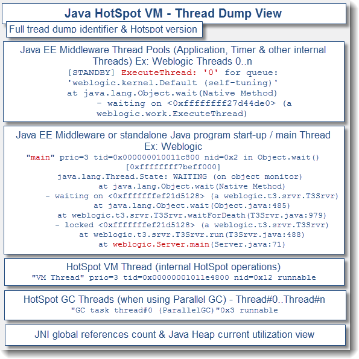

# JVM故障分析及性能优化系列之二：jstack生成的Thread Dump日志结构解析(转载)

> 一个典型的thread dump文件主要由一下几个部分组成：



<!-- more -->

上图将JVM上的线程堆栈信息和线程信息做了详细的拆解。

## **第一部分：Full thread dump identifier**

这一部分是内容最开始的部分，展示了快照文件的生成时间和JVM的版本信息。

```log
2017-10-19 10:46:44 Full thread dump Java HotSpot(TM) 64-Bit Server VM (24.79-b02 mixed mode): 
```

## **第二部分：Java EE middleware, third party & custom application Threads**

这是整个文件的核心部分，里面展示了JavaEE容器（如tomcat、resin等）、自己的程序中所使用的线程信息。这一部分详细的含义见 [Java内存泄漏分析系列之四：jstack生成的Thread Dump日志线程状态分析](http://www.javatang.com/archives/2017/10/25/36441958.html)。

```log
 "resin-22129" daemon prio=10 tid=0x00007fbe5c34e000 nid=0x4cb1 waiting on condition [0x00007fbe4ff7c000]   java.lang.Thread.State: WAITING (parking)    
 at sun.misc.Unsafe.park(Native Method)    
 at java.util.concurrent.locks.LockSupport.park(LockSupport.java:315)    
 at com.caucho.env.thread2.ResinThread2.park(ResinThread2.java:196)    
 at com.caucho.env.thread2.ResinThread2.runTasks(ResinThread2.java:147)    
 at com.caucho.env.thread2.ResinThread2.run(ResinThread2.java:118)   
```

​           

## **第三部分：HotSpot VM Thread**

这一部分展示了JVM内部线程的信息，用于执行内部的原生操作。下面常见的集中内置线程：

**"Attach Listener"**

该线程负责接收外部命令，执行该命令并把结果返回给调用者，此种类型的线程通常在桌面程序中出现。

```
"Attach Listener" daemon prio=5 tid=0x00007fc6b6800800 nid=0x3b07 waiting on condition [0x0000000000000000]   
java.lang.Thread.State: RUNNABLE                         
```

**"DestroyJavaVM"**

执行main()的线程在执行完之后调用JNI中的 jni_DestroyJavaVM() 方法会唤起DestroyJavaVM 线程。在JBoss启动之后，也会唤起DestroyJavaVM线程，处于等待状态，等待其它线程（java线程和native线程）退出时通知它卸载JVM。

 ```
  "DestroyJavaVM" prio=5 tid=0x00007fc6b3001000 nid=0x1903 waiting on condition [0x0000000000000000]   
  java.lang.Thread.State: RUNNABLE                            
 ```

**"Service Thread"**

用于启动服务的线程

```
"Service Thread" daemon prio=10 tid=0x00007fbea81b3000 nid=0x5f2 runnable [0x0000000000000000]   
java.lang.Thread.State: RUNNABLE                              
```

**"CompilerThread"**

用来调用JITing，实时编译装卸CLASS。通常JVM会启动多个线程来处理这部分工作，线程名称后面的数字也会累加，比如CompilerThread1。

```
 "C2 CompilerThread1" daemon prio=10 tid=0x00007fbea814b000 nid=0x5f1 waiting on condition [0x0000000000000000]   java.lang.Thread.State: RUNNABLE "C2 CompilerThread0" daemon prio=10 tid=0x00007fbea8142000 nid=0x5f0 waiting on condition [0x0000000000000000]   
 java.lang.Thread.State: RUNNABLE                             
```

**"Signal Dispatcher"**

Attach Listener线程的职责是接收外部jvm命令，当命令接收成功后，会交给signal dispather 线程去进行分发到各个不同的模块处理命令，并且返回处理结果。signal dispather线程也是在第一次接收外部jvm命令时，进行初始化工作。

 ```
  "Signal Dispatcher" daemon prio=10 tid=0x00007fbea81bf800 nid=0x5ef runnable [0x0000000000000000]   
  java.lang.Thread.State: RUNNABLE                        
 ```

**"Finalizer"**

这个线程也是在main线程之后创建的，其优先级为10，主要用于在垃圾收集前，调用对象的finalize()方法；关于Finalizer线程的几点：（1）只有当开始一轮垃圾收集时，才会开始调用finalize()方法；因此并不是所有对象的finalize()方法都会被执行；（2）该线程也是daemon线程，因此如果虚拟机中没有其他非daemon线程，不管该线程有没有执行完finalize()方法，JVM也会退出；（3）JVM在垃圾收集时会将失去引用的对象包装成Finalizer对象（Reference的实现），并放入ReferenceQueue，由Finalizer线程来处理；最后将该Finalizer对象的引用置为null，由垃圾收集器来回收；（4）JVM为什么要单独用一个线程来执行finalize()方法呢？如果JVM的垃圾收集线程自己来做，很有可能由于在finalize()方法中误操作导致GC线程停止或不可控，这对GC线程来说是一种灾难。

```
 "Finalizer" daemon prio=10 tid=0x00007fbea80da000 nid=0x5eb in Object.wait() [0x00007fbeac044000]  
 	java.lang.Thread.State: WAITING (on object monitor)    
 	at java.lang.Object.wait(Native Method)    
 	at java.lang.ref.ReferenceQueue.remove(ReferenceQueue.java:135)    
	 - locked <0x00000006d173c1a8> (a java.lang.ref.ReferenceQueue$Lock)    
	 at java.lang.ref.ReferenceQueue.remove(ReferenceQueue.java:151)    
	 at java.lang.ref.Finalizer$FinalizerThread.run(Finalizer.java:209)                             
```

**"Reference Handler"**

JVM在创建main线程后就创建Reference Handler线程，其优先级最高，为10，它主要用于处理引用对象本身（软引用、弱引用、虚引用）的垃圾回收问题 。

 ```
  "Reference Handler" daemon prio=10 tid=0x00007fbea80d8000 nid=0x5ea in Object.wait() [0x00007fbeac085000]   java.lang.Thread.State: WAITING (on object monitor)   
  	at java.lang.Object.wait(Native Method)    
  	at java.lang.Object.wait(Object.java:503)   
     at java.lang.ref.Reference$ReferenceHandler.run(Reference.java:133)    
     - locked <0x00000006d173c1f0> (a java.lang.ref.Reference$Lock) 
 ```

​                           

**"VM Thread"**

JVM中线程的母体，根据HotSpot源码中关于vmThread.hpp里面的注释，它是一个单例的对象（最原始的线程）会产生或触发所有其他的线程，这个单例的VM线程是会被其他线程所使用来做一些VM操作（如清扫垃圾等）。在 VM Thread 的结构体里有一个VMOperationQueue列队，所有的VM线程操作(vm_operation)都会被保存到这个列队当中，VMThread 本身就是一个线程，它的线程负责执行一个自轮询的loop函数(具体可以参考：VMThread.cpp里面的void VMThread::loop()) ，该loop函数从VMOperationQueue列队中按照优先级取出当前需要执行的操作对象(VM_Operation)，并且调用VM_Operation->evaluate函数去执行该操作类型本身的业务逻辑。VM操作类型被定义在vm_operations.hpp文件内，列举几个：ThreadStop、ThreadDump、PrintThreads、GenCollectFull、GenCollectFullConcurrent、CMS_Initial_Mark、CMS_Final_Remark….. 有兴趣的同学，可以自己去查看源文件。

```
"VM Thread" prio=10 tid=0x00007fbea80d3800 nid=0x5e9 runnable                              
```

## **第四部分：HotSpot GC Thread**

JVM中用于进行资源回收的线程，包括以下几种类型的线程：

**"VM Periodic Task Thread"**

该线程是JVM周期性任务调度的线程，它由WatcherThread创建，是一个单例对象。该线程在JVM内使用得比较频繁，比如：定期的内存监控、JVM运行状况监控。

```
 "VM Periodic Task Thread" prio=10 tid=0x00007fbea82ae800 nid=0x5fa waiting on condition                            
```

可以使用jstat 命令查看GC的情况，比如查看某个进程没有存活必要的引用可以使用命令 jstat -gcutil  250 7 参数中pid是进程id，后面的250和7表示每250毫秒打印一次，总共打印7次。这对于防止因为应用代码中直接使用native库或者第三方的一些监控工具的内存泄漏有非常大的帮助。

**"GC task thread#0 (ParallelGC)"**

垃圾回收线程，该线程会负责进行垃圾回收。通常JVM会启动多个线程来处理这个工作，线程名称中#后面的数字也会累加。

```
"GC task thread#0 (ParallelGC)" prio=5 tid=0x00007fc6b480d000 nid=0x2503 runnable 
"GC task thread#1 (ParallelGC)" prio=5 tid=0x00007fc6b2812000 nid=0x2703 runnable 
"GC task thread#2 (ParallelGC)" prio=5 tid=0x00007fc6b2812800 nid=0x2903 runnable 
"GC task thread#3 (ParallelGC)" prio=5 tid=0x00007fc6b2813000 nid=0x2b03 runnable                              
```

**如果在JVM中增加了** **-XX:+UseConcMarkSweepGC** **参数将会启用CMS （Concurrent Mark-Sweep）GC Thread方式，以下是该模式下的线程类型：**

**"Gang worker#0 (Parallel GC Threads)"**

原来垃圾回收线程GC task thread#0 (ParallelGC) 被替换为 Gang worker#0 (Parallel GC Threads)。Gang worker 是JVM用于年轻代垃圾回收(minor gc)的线程。

```
 "Gang worker#0 (Parallel GC Threads)" prio=10 tid=0x00007fbea801b800 nid=0x5e4 runnable  
 "Gang worker#1 (Parallel GC Threads)" prio=10 tid=0x00007fbea801d800 nid=0x5e7 runnable                              
```

**"Concurrent Mark-Sweep GC Thread"**

并发标记清除垃圾回收器（就是通常所说的CMS GC）线程， 该线程主要针对于年老代垃圾回收。

```
 "Concurrent Mark-Sweep GC Thread" prio=10 tid=0x00007fbea8073800 nid=0x5e8 runnable 
```

​                             

**"Surrogate Locker Thread (Concurrent GC)"**

此线程主要配合CMS垃圾回收器来使用，是一个守护线程，主要负责处理GC过程中Java层的Reference（指软引用、弱引用等等）与jvm 内部层面的对象状态同步。

```
 "Surrogate Locker Thread (Concurrent GC)" daemon prio=10 tid=0x00007fbea8158800 nid=0x5ee waiting on condition [0x0000000000000000]   
 java.lang.Thread.State: RUNNABLE                             
```

这里以 WeakHashMap 为例进行说明，首先是一个关键点：

- WeakHashMap和HashMap一样，内部有一个Entry[]数组;
- WeakHashMap的Entry比较特殊，它的继承体系结构为Entry->WeakReference->Reference;
- Reference 里面有一个全局锁对象：Lock，它也被称为pending_lock，注意：它是静态对象；
- Reference 里面有一个静态变量：pending；
- Reference 里面有一个静态内部类：ReferenceHandler的线程，它在static块里面被初始化并且启动，启动完成后处于wait状态，它在一个Lock同步锁模块中等待；
- WeakHashMap里面还实例化了一个ReferenceQueue列队

假设，WeakHashMap对象里面已经保存了很多对象的引用，JVM 在进行CMS GC的时候会创建一个ConcurrentMarkSweepThread（简称CMST）线程去进行GC。ConcurrentMarkSweepThread线程被创建的同时会创建一个SurrogateLockerThread（简称SLT）线程并且启动它，SLT启动之后，处于等待阶段。CMST开始GC时，会发一个消息给SLT让它去获取Java层Reference对象的全局锁：Lock。直到CMS GC完毕之后，JVM 会将WeakHashMap中所有被回收的对象所属的WeakReference容器对象放入到Reference 的pending属性当中（每次GC完毕之后，pending属性基本上都不会为null了），然后通知SLT释放并且notify全局锁:Lock。此时激活了ReferenceHandler线程的run方法，使其脱离wait状态，开始工作了。ReferenceHandler这个线程会将pending中的所有WeakReference对象都移动到它们各自的列队当中，比如当前这个WeakReference属于某个WeakHashMap对象，那么它就会被放入相应的ReferenceQueue列队里面（该列队是链表结构）。 当我们下次从WeakHashMap对象里面get、put数据或者调用size方法的时候，WeakHashMap就会将ReferenceQueue列队中的WeakReference依依poll出来去和Entry[]数据做比较，如果发现相同的，则说明这个Entry所保存的对象已经被GC掉了，那么将Entry[]内的Entry对象剔除掉。

**第五部分：JNI global references count**

这一部分主要回收那些在native代码上被引用，但在java代码中却没有存活必要的引用，对于防止因为应用代码中直接使用native库或第三方的一些监控工具的内存泄漏有非常大的帮助。

```
 JNI global references: 830 
```

​                            
