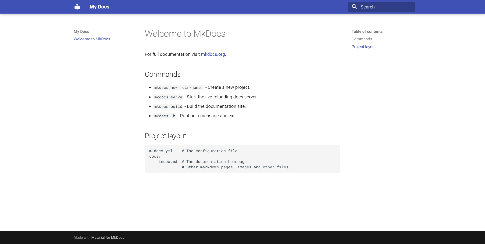
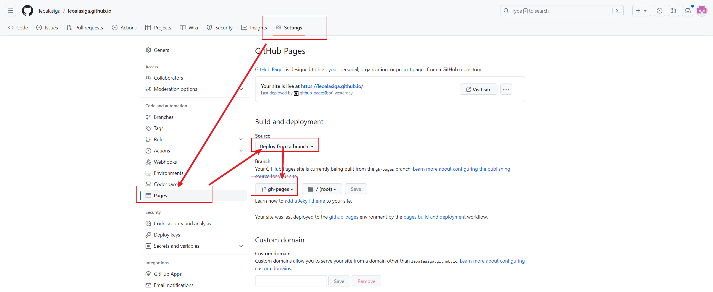
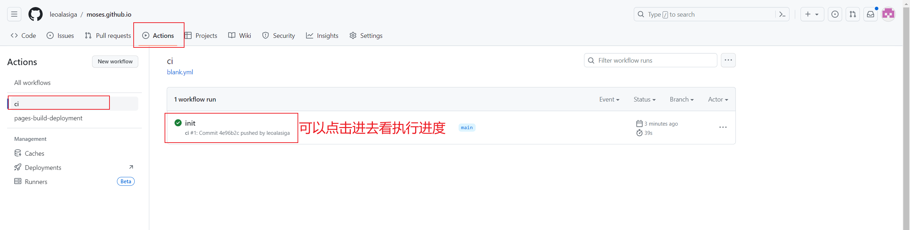

# 白嫖GithubPage搭建自己的博客!

> 利用Mkdocs+Material+GithubPage+Github Action自动化搭建你自己的博客！

<!-- more -->

## 什么是Mkdocs

>  Write your documentation in Markdown and create a professional static site in minutes – searchable, customizable, in 60+ languages, for all devices.

用Markdown 撰写我们的文档，通过Mkdocs我们可以在几分钟内完成构建一个专业的静态网站。

这就很厉害了，接下来，我们来看看怎么去使用Mkdocs


## 安装Mkdocs

通过pip安装

```shell
$ pip install mkdocs-material
```

查看版本

```shell
$ mkdocs -V
mkdocs, version 1.5.2 from C:\Python311\Lib\site-packages\mkdocs (Python 3.11)
```


## 创建你的网站

+ 创建一个文件夹如my_site

+ 切换到这个文件夹下，通过cmd或者右键Git Bash Here，打开命令行工具

+ 输入以下的命令

```shell
$ mkdocs new .
```

就会再当前目录生成如下结构的内容

```
.
├─ docs/
│  └─ index.md
└─ mkdocs.yml
```

+ 然后使用如下命令运行你的网站

```shell
$ mkdocs serve
INFO    -  Building documentation...
INFO    -  Cleaning site directory
INFO    -  Documentation built in 0.06 seconds
INFO    -  [14:51:49] Watching paths for changes: 'docs', 'mkdocs.yml'
INFO    -  [14:51:49] Serving on http://127.0.0.1:8000/
WARNING -  [14:51:59] "GET /%E6%95%99%E7%A8%8B/mkdocs/ HTTP/1.1" code 404
INFO    -  [14:52:07] Browser connected: http://127.0.0.1:8000/
```

+ 访问上面这个网站，你就可以看到你的网站了


+ 这个时候，你的网站就搭建完成了，doc/index.md显示的内容就是你首页展示的内容

+ 然后你就会觉得这个网站很丑，你想让他变得漂亮，这个时候，只要做个简单的配置，你就可以创建出一个良好主题的mkdocs网站


## 配置你的网站

+ 打开my_site下的mkdocs.yml,只要配置一句话，既可以配置全新的主题

```yaml
theme:
  name: material
```

+ 重启你的服务，你就能获得全新的主题



+ 这个时候，你可能觉得还是捡漏，这个时候，你可以去[Material官网](https://squidfunk.github.io/mkdocs-material/setup/)，查看更多的配置，优化你的站点
+ 或者参考的我的配置

```yaml
#[Info]
site_name: leoalasiaga Docs   #网站名字
site_description: the notes record by leoalsiga
site_author: leoalasiaga #作者名
site_url: https://leoalasiga.github.io/  #网站地址
copyright: Copyright &copy; 2023 leoalasiaga # 左下角的版权声明

# [Navigtion]
nav:
  - Home: index.md
  - Java: 
    - java/index.md
    - 设计模式: java/设计模式/index.md
  - Dokcer:
    - docker/index.md
 #   - Installation: guide/installation.md
 #   - Basics: guide/basics.md
 #   - Configuration: guide/config.md
  - K8s:
    - k8s/index.md
  - 教程:
    - 教程/mkdocs.md
  - About: about.md

#[UI]
theme:
  name: material
  language: zh # 一些提示性的文字会变成中文
  font:
    text: Roboto
    code: Roboto Mono
  features:
    - header.autohide  #自动隐藏
    #- announce.dismiss #呈现可标记为由用户读取的临时公告，可以包含一个用于取消当前公告的按钮
    - navigation.instant #自动隐藏
    - navigation.tracking #地址栏中的 URL 将自动更新为在目录中突出显示的活动锚点
    - content.code.annotate
    - toc.integrate
    - toc.follow
    - navigation.path
    - navigation.top # 返回顶部的按钮 在上滑时出现
    - navigation.tabs
    - navigation.prune
    - navigation.footer
    - navigation.tabs.sticky  #启用粘性选项卡后，导航选项卡将锁定在标题下方，并在向下滚动时始终保持可见
    - navigation.sections #启用部分后，顶级部分在边栏中呈现为1220px以上视口的组，但在移动设备上保持原样
    # - navigation.expand # 打开Tab时左侧目录全部展开
    - content.code.copy
    - navigation.indexes #启用节索引页后，可以将文档直接附加到节
    - search.share #搜索分享按钮
    - search.suggest # 搜索输入一些字母时推荐补全整个单词
    - search.highlight # 搜索出的文章关键词加入高亮
  palette: 
    # Palette toggle for light mode
    - media: "(prefers-color-scheme: light)"
      scheme: default # 日间模式
      toggle:
        icon: material/brightness-7  # 图标
        name: Switch to dark mode
      primary: deep ## 上方的, [red, pink, purple, deep, purple, indigo, blue, light blue, cyan, teal, green, light green, lime, yellow, amber, orange, deep orange, brown, grey, blue, grey, black, white]
      accent: deep # # 链接等可交互元件的高亮色 [red, pink, purple, deep, purple, indigo, blue, light, blue, cyan, teal, green, light, green, lime, yellow, amber, orange, deep orange]

    # Palette toggle for dark mode
    - media: "(prefers-color-scheme: dark)"
      scheme: slate # 夜间模式
      primary: deep #, [red, pink, purple, deep, purple, indigo, blue, light blue, cyan, teal, green, light green, lime, yellow, amber, orange, deep orange, brown, grey, blue, grey, black, white]
      accent: deep # [red, pink, purple, deep, purple, indigo, blue, light, blue, cyan, teal, green, light, green, lime, yellow, amber, orange, deep orange]
      toggle:
        icon: material/brightness-4
        name: Switch to light mode
    
  icon: 
    repo: fontawesome/brands/github #右上角图标
repo_name: leoalasiga.github.io # 右上角的名
repo_url: https://github.com/leoalasiga/leoalasiga.github.io.git # 右上角点击跳转的链接


markdown_extensions:
  - admonition
  - abbr
  - pymdownx.caret    
  - pymdownx.details
  - pymdownx.keys
  - pymdownx.mark
  - pymdownx.tilde
  - pymdownx.tabbed:
      alternate_style: true 
  - md_in_html
  - pymdownx.arithmatex:  # latex支持
      generic: true
  - toc:
      permalink: true # 固定标题位置为当前位置
      title: On this page
  - pymdownx.highlight: # 代码块高亮
      anchor_linenums: true
      # linenums: true # 显示行号
      # auto_title: true # 显示编程语言名称
  - pymdownx.inlinehilite
  - pymdownx.snippets
  - attr_list
  - pymdownx.emoji:
      emoji_index: !!python/name:materialx.emoji.twemoji
      emoji_generator: !!python/name:materialx.emoji.to_svg
  - pymdownx.superfences # 代码块高亮插件
  - meta # 支持Markdown文件上方自定义标题标签等
  - tables
     
extra_javascript:
  - javascripts/extra.js
  - javascripts/mathjax.js
  - https://polyfill.io/v3/polyfill.min.js?features=es6
  - https://cdn.jsdelivr.net/npm/mathjax@3/es5/tex-mml-chtml.js
extra_css:
  - stylesheets/extra.css


extra:
  generator: false  #删除页脚显示“使用 MkDocs 材料制造”
 # social:
  #  - icon: fontawesome/brands/twitter 
  #    link: https://twitter.com/
  #  - icon: fontawesome/brands/github
  #    link: https://github.com/
  #  - icon: fontawesome/brands/bilibili
  #    link: https://space.bilibili.com/
  #  - icon: fontawesome/solid/paper-plane
  #    link: mailto:<xxxxxx@qq.com> #联系方式
  #
  
#  analytics: 
#    provider: google
#    property: G-XXXXXXXXXX # Google Analytics ID
#    feedback:
#      title: 此页面有帮助吗？
#      ratings:
#        - icon: material/thumb-up-outline
#          name: This page was helpful
#          data: 1
#          note: >-
#            谢谢你的反馈！
#        - icon: material/thumb-down-outline
#          name: This page could be improved
#          data: 0
#          note: >- 
#            Thanks for your feedback! Help us improve this page by
#            using our <a href="https://marketingplatform.google.com/about/analytics/" target="_blank" rel="noopener">feedback form</a>.
#  
#  consent:
#    title: Cookie consent
#    description: >- 
#      我们也使用cookies来识别您的重复访问和偏好来衡量我们文档的有效性以及用户是否找到他们要找的东西。
#      如果你同意,你可以帮助我们让我们的网站更好


plugins:
  - search
  - tags:
      tags_file: tag.md #标签
```


## 部署你的网站

> 当你完成你的网站构建之后，你想去部署你的博客网站，你可以选择以下两种方式

+ 自己构建，部署到自己的服务器上

```shell
$ mkdocs build
```

你就会在你的目录下生成一个site目录，里面的内容就是mkdocs给你编译好的静态网站

```
.
├─ docs/
│  └─ index.md
├─ site/
│  └─ assets/
│  └─ search/
│  └─ 404.html
│  └─ index.html
│  └─ sitemap.xml
│  └─ sitemap.xml.gz
└─ mkdocs.yml
```

你可以将这个目录，部署到你自己的服务器上，配置nginx等访问，从而实现你的博客网站的访问

+ 或者，你也可以选择和我一样，**白嫖**github的资源，利用github page，搭建你自己的博客网站


## 用github page创建你得博客网站

### 创建一个仓库

去github，建立一个仓库，仓库的名称如下(username就是你的github用户名)

```txt
<username>.github.io
```

如图


### clone你的仓库

```shell
$ git clone https://github.com/username/username.github.io
```

### 提交你的代码

将你通过mkdocs build的文件，即site目录里的所有内容，全部拷贝到你的GitHub clone下来的目录username.github.io,然后执行以下命令

```shell
# 添加当前目录所有文件
$ git add .
# 添加提交描述
$ git commit -m "Initial commit"
# 推送至仓库
$ git push -u origin main
```

### 访问你的网站

这个时候，你的网站就已经搭建完成了，直接访问这个地址就可以访问了 https://username.github.io

### 能不能更简便一点？

这时候，你会发现，这样做很麻烦，每次都要自己本地构建静态文件，然后拷贝到相关目录下，然后push到仓库。那么有没有方法可以自动化的帮你完成这个流程，帮你自动化构建完成这个内容呢？

答案就是github action！！！！


## 通过github action完成个人网站的自动化构建

> 在mkdocs-material的官网，其实已经教了我们怎么部署我们的个人网站了

> Using [GitHub Actions](https://github.com/features/actions) you can automate the deployment of your project documentation. At the root of your repository, create a new GitHub Actions workflow, e.g. `.github/workflows/ci.yml`, and copy and paste the following contents:
>
> 意思就是使用GitHub Actions，就可以自动化的部署你的网站，在仓库的根目录，创建一个新的GitHub Actions workflow，比如：`.github/workflows/ci.yml`,然后拷贝粘贴下面的内容

### 建立github action

即在我们的username.github.io目录，删除之前的文件，将my_site里的docs目录和mkdocs.yml文件拷贝到username.github.io目录，并添加`.github/workflows/ci.yml`，即username.github.io目录的文件内容如下

```
.
├─ docs/
│  └─ index.md
├─ .github/
│  └─ workflows/
│    └─ ci.yml
└─ mkdocs.yml
```

然后编辑这个文件，添加这个内容

```yaml
name: ci 
on:
  push:
    branches:
      - main # 根据实际的分支情况设置
permissions:
  contents: write
jobs:
  deploy:
    runs-on: ubuntu-latest 
    steps:
      - uses: actions/checkout@v3
      - uses: actions/setup-python@v4
        with:
          python-version: 3.x
      - run: echo "cache_id=$(date --utc '+%V')" >> $GITHUB_ENV 
      - uses: actions/cache@v3
        with:
          key: mkdocs-material-${{ env.cache_id }}
          path: .cache
          restore-keys: |
            mkdocs-material-
      - run: pip install mkdocs-material 
      - run: mkdocs gh-deploy --force
```

他的原理，相当于通过github action，在ubuntu-latest的镜像内，执行了我们人工操作的安装mkdocs-material， 然后部署了我们的网站

然后后续我们只要push我们的仓库，我们就可以自动化的部署我们的网站了


当然，做到这里，你会发现访问的网站变成404了，这时候，你要去github在配置一下




然后当你git push 完你的文档，github 就会自动给你构建展示你的网站，并部署到你gh-pages分支内


### 查看github action构建进度




## 参考

[github pages](https://pages.github.com/) 


[material]( https://squidfunk.github.io/mkdocs-material/) 
