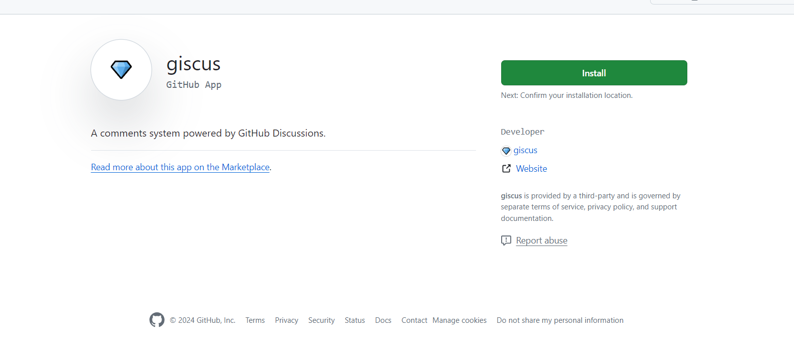
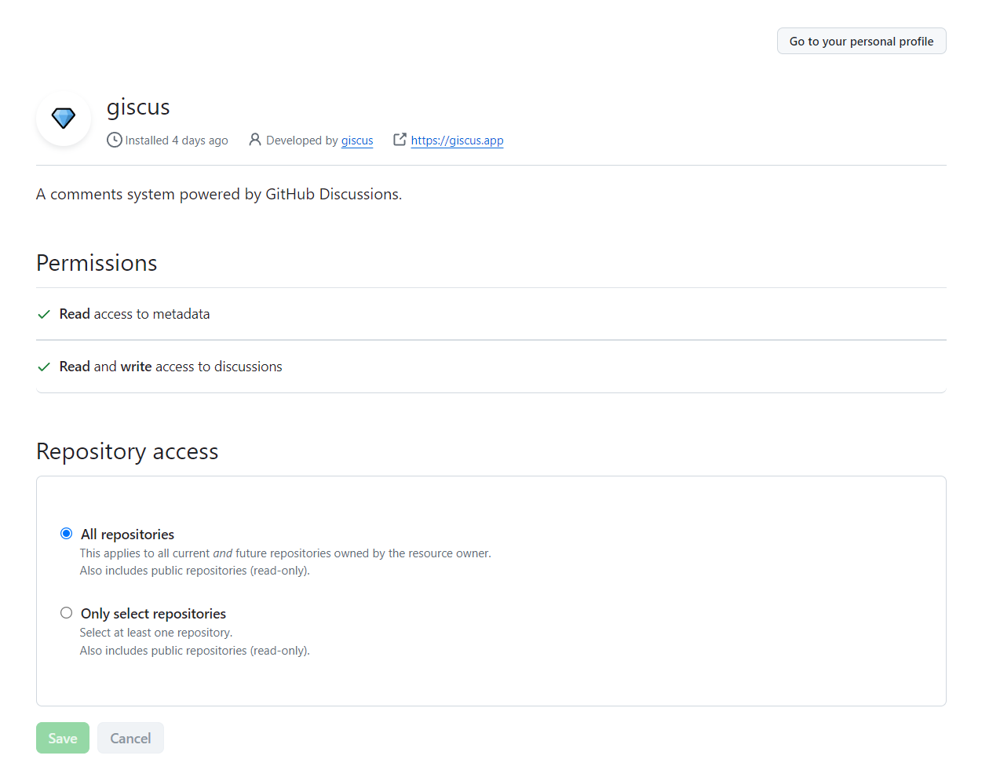
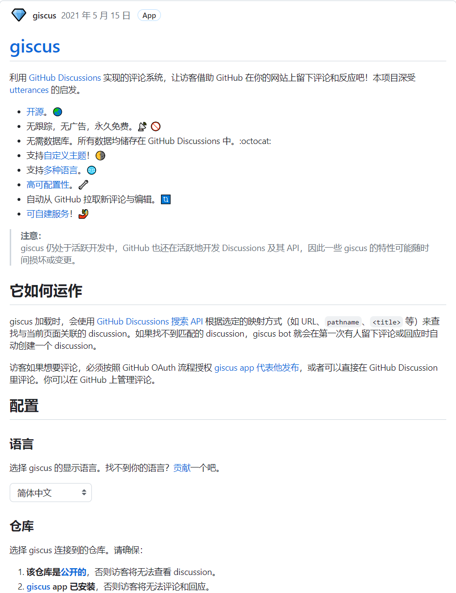
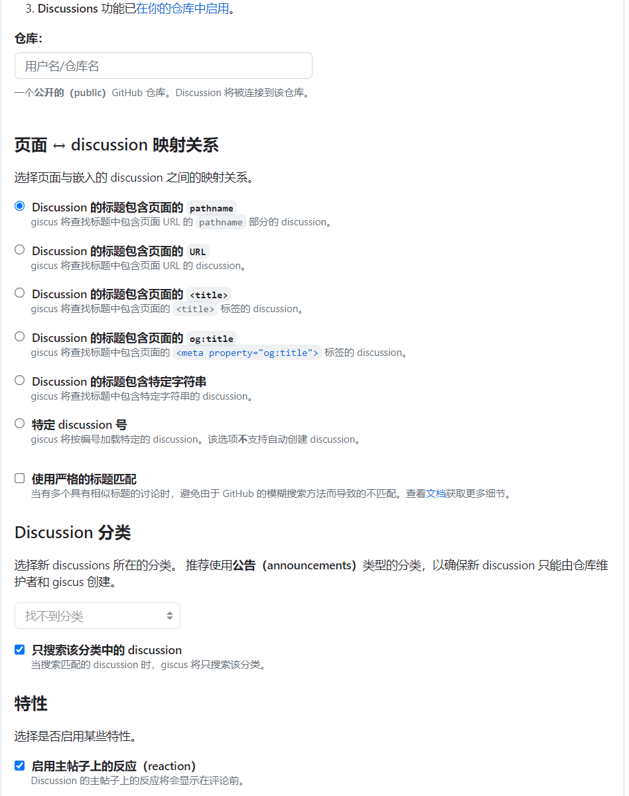
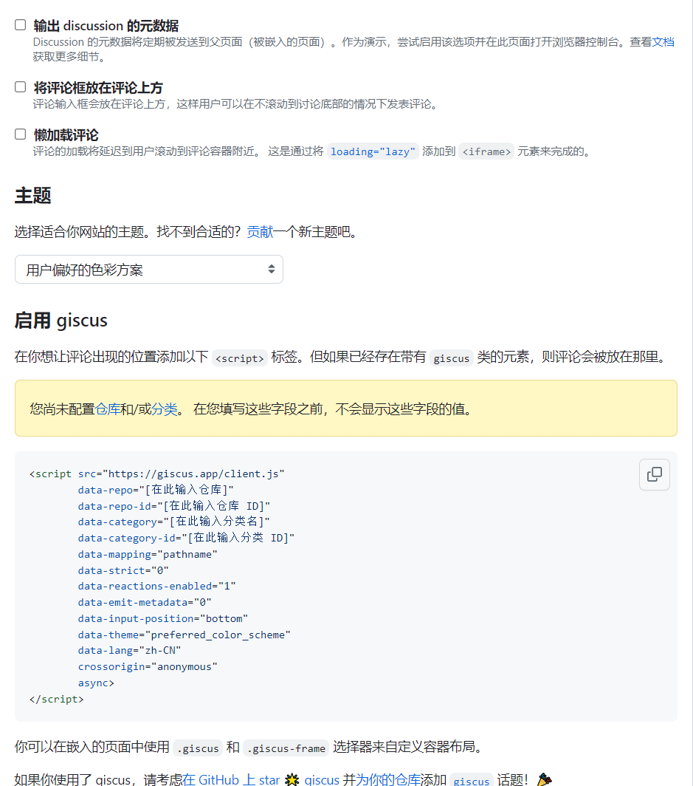
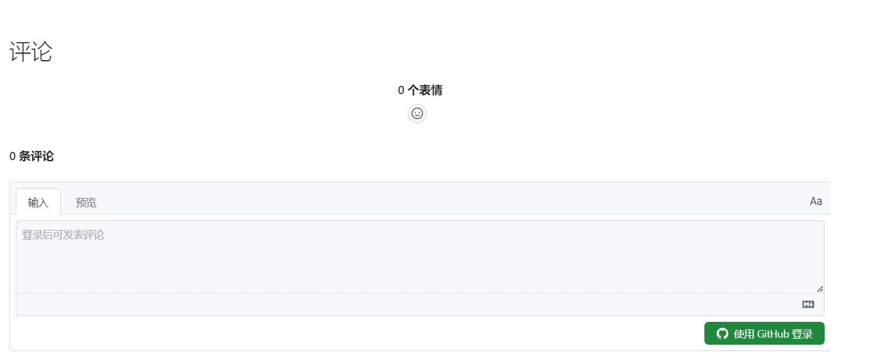

# 白嫖GithubPage搭建自己的博客!（二）
> 之前的文章,我已经教会大家白嫖github pages创建自己的博客体系了，现在，让我们丰富我们的博客，为我们的博客添加评论区吧

<!-- more -->

Material for MkDocs可以很轻松的在我们的每篇文章下面，集成第三方的评论系统

## 第一步：扩展主题

`Material` 支持你扩展他的主题，通过简单的配置:

首先在你的`mkdoc.yml`里添加以下代码

```yaml
theme:
  name: material
  custom_dir: overrides
```

然后再`mkdoc.ym`l所在的这个目录，建立`overrides`这个文件夹,建好之后目录结构如下：

```
.
├─ docs/
│  └─ index.md
├─ overrides/
└─ mkdocs.yml
```

然后后续你只要将`Material `要求的同名同路径的文件，按照相关的路径放到这个目录`overrides`，就能实现扩展`Material`的主题的效果；

`Material`主题文件对应表

```
.
├─ .icons/                             # Bundled icon sets  图标集
├─ assets/
│  ├─ images/                          # Images and icons 图像和图标
│  ├─ javascripts/                     # JavaScript files 
│  └─ stylesheets/                     # Style sheets
├─ partials/
│  ├─ integrations/                    # Third-party integrations
│  │  ├─ analytics/                    # Analytics integrations
│  │  └─ analytics.html                # Analytics setup
│  ├─ languages/                       # Translation languages
│  ├─ actions.html                     # Actions
│  ├─ alternate.html                   # Site language selector
│  ├─ comments.html                    # Comment system (empty by default)
│  ├─ consent.html                     # Consent
│  ├─ content.html                     # Page content
│  ├─ copyright.html                   # Copyright and theme information
│  ├─ feedback.html                    # Was this page helpful?
│  ├─ footer.html                      # Footer bar
│  ├─ header.html                      # Header bar
│  ├─ icons.html                       # Custom icons
│  ├─ language.html                    # Translation setup
│  ├─ logo.html                        # Logo in header and sidebar
│  ├─ nav.html                         # Main navigation
│  ├─ nav-item.html                    # Main navigation item
│  ├─ pagination.html                  # Pagination (used for blog)
│  ├─ palette.html                     # Color palette toggle
│  ├─ post.html                        # Blog post excerpt
│  ├─ progress.html                    # Progress indicator
│  ├─ search.html                      # Search interface
│  ├─ social.html                      # Social links
│  ├─ source.html                      # Repository information
│  ├─ source-file.html                 # Source file information
│  ├─ tabs.html                        # Tabs navigation
│  ├─ tabs-item.html                   # Tabs navigation item
│  ├─ tags.html                        # Tags
│  ├─ toc.html                         # Table of contents
│  ├─ toc-item.html                    # Table of contents item
│  └─ top.html                         # Back-to-top button
├─ 404.html                            # 404 error page
├─ base.html                           # Base template
├─ blog.html                           # Blog index page
├─ blog-archive.html                   # Blog archive index page
├─ blog-category.html                  # Blog category index page
├─ blog-post.html                      # Blog post page
└─ main.html                           # Default page
```

## 第二步：修改评论的文件

在这里，因为我们要修改评论区的内容，我们就修改`comments.html`这个页面，然后我们在我们的``文件夹里添加这个文件

```
.
├─ docs/
│  └─ index.md
├─ overrides/
│  └─ partials/
│  	  └─ comments.html
└─ mkdocs.yml
```

然后编辑这个`comments.html`,加入如下内容：

```javascript

  <h2 id="__comments">{{ lang.t("meta.comments") }}</h2>
  <!-- Insert generated snippet here -->

  <!-- 这里要插入第三方插件生成的内容 -->

  <!-- Synchronize Giscus theme with palette -->
  <script>
    var giscus = document.querySelector("script[src*=giscus]")

    // Set palette on initial load
    var palette = __md_get("__palette")
    if (palette && typeof palette.color === "object") {
      var theme = palette.color.scheme === "slate"
        ? "transparent_dark"
        : "light"

      // Instruct Giscus to set theme
      giscus.setAttribute("data-theme", theme) 
    }

    // Register event handlers after documented loaded
    document.addEventListener("DOMContentLoaded", function() {
      var ref = document.querySelector("[data-md-component=palette]")
      ref.addEventListener("change", function() {
        var palette = __md_get("__palette")
        if (palette && typeof palette.color === "object") {
          var theme = palette.color.scheme === "slate"
            ? "transparent_dark"
            : "light"

          // Instruct Giscus to change theme
          var frame = document.querySelector(".giscus-frame")
          frame.contentWindow.postMessage(
            { giscus: { setConfig: { theme } } },
            "https://giscus.app"
          )
        }
      })
    })
  </script>

```

## 第三步：集成第三方评论插件Giscus

**首先**：为你的`github`安装`Giscus Github App`,点击[传送门](https://github.com/apps/giscus)



然后点击`install`,完成`giscus` 的安装，然后你就可以配置你的`giscus`给全部仓库开放，还是给部分仓库开放，也可以访问上面的传送门，重新配置



**然后：**访问`Giscus`的官网，生成一串`snippet `, 点击[传送门](https://giscus.app/zh-CN)

按照中文提示，填写你要配置`Giscus`的仓库





这样你就得到了属于你这个仓库的`snippet`

```javascript
<script
  src="https://giscus.app/client.js"
  data-repo="<username>/<repository>"
  data-repo-id="..."
  data-category="..."
  data-category-id="..."
  data-mapping="pathname"
  data-reactions-enabled="1"
  data-emit-metadata="1"
  data-theme="light"
  data-lang="en"
  crossorigin="anonymous"
  async
>
</script>
```

然后将这个`Snippet`粘贴到你的`comments.html`就实现了`Giscus`的配置

```javascript

  <h2 id="__comments">{{ lang.t("meta.comments") }}</h2>
  <!-- Insert generated snippet here -->

      <script
      src="https://giscus.app/client.js"
      data-repo="<username>/<repository>"
      data-repo-id="..."
      data-category="..."
      data-category-id="..."
      data-mapping="pathname"
      data-reactions-enabled="1"
      data-emit-metadata="1"
      data-theme="light"
      data-lang="en"
      crossorigin="anonymous"
      async
    >
    </script>

  <!-- Synchronize Giscus theme with palette -->
  <script>
    var giscus = document.querySelector("script[src*=giscus]")

    // Set palette on initial load
    var palette = __md_get("__palette")
    if (palette && typeof palette.color === "object") {
      var theme = palette.color.scheme === "slate"
        ? "transparent_dark"
        : "light"

      // Instruct Giscus to set theme
      giscus.setAttribute("data-theme", theme) 
    }

    // Register event handlers after documented loaded
    document.addEventListener("DOMContentLoaded", function() {
      var ref = document.querySelector("[data-md-component=palette]")
      ref.addEventListener("change", function() {
        var palette = __md_get("__palette")
        if (palette && typeof palette.color === "object") {
          var theme = palette.color.scheme === "slate"
            ? "transparent_dark"
            : "light"

          // Instruct Giscus to change theme
          var frame = document.querySelector(".giscus-frame")
          frame.contentWindow.postMessage(
            { giscus: { setConfig: { theme } } },
            "https://giscus.app"
          )
        }
      })
    })
  </script>

```


## 最后：在你的文章里配上标签

在你的文章头里面，配置以下内容：

```markdown
---
comments: true
---

...
文章内容
```

然后本地启动服务，你就会发现在你的文章最下面，多了评论区

```shell
$ mkdocs serve
```




## 参考

[giscus](https://giscus.app/zh-CN)

[material:adding-a-comment-system](https://squidfunk.github.io/mkdocs-material/setup/adding-a-comment-system/)


