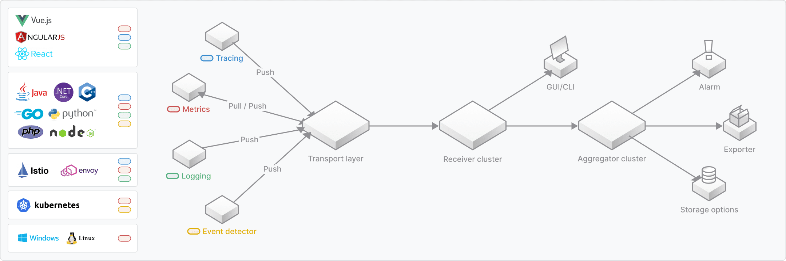
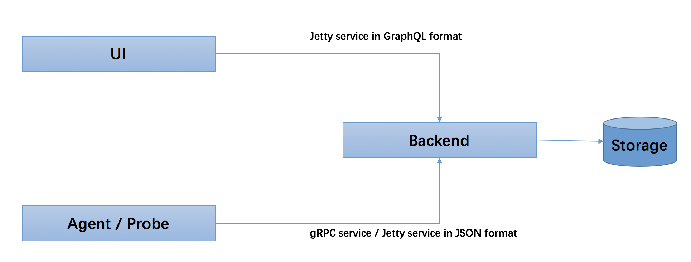

# Skywalking教程

## 概念与设计

### 什么是skywalking?

SkyWalking: 一个开源的可观测平台, 用于从服务和云原生基础设施收集, 分析, 聚合及可视化数据。SkyWalking 提供了一种简便的方式来清晰地观测分布式系统, 甚至横跨多个云平台。SkyWalking 更是一个现代化的应用程序性能监控(Application Performance Monitoring)系统, 尤其专为云原生、基于容器的分布式系统设计.


### 为什么使用 SkyWalking?

在许多不同的场景下, SkyWalking 为观察和监控分布式系统提供了解决方案。首先是像传统的方式那样, SkyWalking 为服务提供了自动打点的代理, 如 Java, C# , Node.js , Go , PHP 以及 Nginx LUA（包括 Python 和 C++ 调用的 SDK 捐献）。

对于多数语言，持续部署环境，云原生基础设施正变得更加强大，但也更加复杂。

Skywalking 的服务网格接收器可以让 Skywalking 接收来自服务网格框架（例如 Istio , Linkerd）的遥测数据，以帮助用户理解整个分布式系统。

总之, SkyWalking 为 **服务(service)**, **服务实例(service instance)**, 以及 **端点(endpoint)** 提供了可观测能力。服务(Service), 实例(Instance) 以及 端点(Endpoint) 等概念在如今随处可见, 所以让我们先了解一下他们在 SkyWalking 中都表示什么意思：

- **服务(Service)**. 表示对请求提供相同行为的一组工作负载. 在使用打点代理或 SDK 的时候,你可以定义服务的名字. SkyWalking 还可以使用在 Istio 等平台中定义的名称。
- **服务实例(Service Instance)**. 上述的一组工作负载中的每一个工作负载称为一个实例. 就像 Kubernetes 中的 `pods` 一样,服务实例未必就是操作系统上的一个进程. 但当你在使用打点代理的时候, 一个服务实例实际就是操作系统上的一个真实进程.
- **端点(Endpoint)**. 对于特定服务所接收的请求路径, 如 HTTP 的 URI 路径和 gRPC 服务的类名 + 方法签名。

使用 SkyWalking 时, 用户可以看到服务与端点之间的拓扑结构, 每个服务/服务实例/端点的性能指标, 还可以设置报警规则。

除此之外, 你还可以通过以下方式集成

1. 其他分布式追踪使用 Skywalking 原生代理和Zipkin , Jaeger 和 OpenCensus 的 SDK；
2. 其他度量指标系统，例如 Prometheus , Sleuth(Micrometer。


### 架构

SkyWalking 逻辑上分为四部分: **探针**, **平台后端**, **存储**和**用户界面**.



- **探针** 收集遥测数据，包括各种格式的度量、跟踪、日志和事件（SkyWalking、Zipkin、OpenTelemetry、Prometheus、Zabbix等）
- **平台后端**, 支持数据聚合、分析和流式处理，涵盖跟踪、度量、日志和事件。可担任聚合器角色、接收器角色或两者兼任。
- **存储** 通过开放的插件化的接口存放 SkyWalking 数据. 你可以选择一个既有的存储系统, 如 ElasticSearch, H2 或 MySQL 集群(Sharding-Sphere 管理),也可以选择自己实现一个存储系统. 当然, 我们非常欢迎你贡献新的存储系统实现。
- **UI** 一个基于接口高度定制化的Web系统，用户可以可视化查看和管理 SkyWalking 数据。


### 设计目标

- **保持可观测性**. 不管目标系统如何部署, SkyWalking 总要提供一种方案或集成方式来保持对目标系统的观测, 基于此, SkyWalking 提供了数种运行时探针。
- **拓扑结构, 性能指标和追踪一体化**. 理解分布式系统的第一步是通过观察其拓扑结构图. 拓扑图可以将复杂的系统在一张简单的图里面进行可视化展现. 基于拓扑图，运维支撑系统相关人员需要更多关于服务/实例/端点/调用的性能指标. 链路追踪(trace)作为详细的日志, 对于此种性能指标来说很有意义, 如你想知道什么时候端点延时变得很长, 想了解最慢的链路并找出原因. 因此你可以看到, 这些需求都是从大局到细节的, 都缺一不可. SkyWalking 集成并提供了一系列特性来使得这些需求成为可能, 并且使之易于理解.
- **轻量级**. 有两个方面需要保持轻量级. (1) 探针, 我们通常依赖于网络传输框架, 如 gRPC. 在这种情况下, 探针就应该尽可能小, 防止依赖库冲突以及虚拟机的负载压力(例如 JVM 永久代内存占用压力). (2) 作为一个观测平台, 在你的整个项目环境中只是次要系统, 因此我们使用自己的轻量级框架来构建后端核心服务. 所以你不需要部署并维护大数据相关的平台, SkyWalking 在技术栈方面应该足够简单。
- **可插拔**. SkyWalking 核心团队提供了许多默认实现, 但这肯定是不够的, 也不可能适用于每一种场景, 因此我们提供了大量的特性来支持可插拔功能。
- **可移植**. SkyWalking 可以运行在多种环境下, 包括: (1) 使用传统的注册中心, 如 [Eureka](https://github.com/spring-cloud/spring-cloud-netflix) (2) 使用包含服务发现的RPC框架，如Spring Cloud, Apache Dubbo (3) 在现代基础设施中使用服务网格 (4) 使用云服务 (5) 跨云部署

在所有这些情况下，SkyWalking 应该运行良好

- **可互操作**. 可观测性是一个庞大的领域, 即使有强大的社区, SkyWalking 不可能支持所有方方面面, 因此 SkyWalking 支持与其他运维支撑系统进行互操作, 主要是探针, 如 Zipkin, Jaeger, OpenTracing 和 OpenCensus. SkyWalking 接收并理解他们的数据格式, 这对于终端用户来说是非常有用的, 因为不需要他们更换已有的库。


## 探针

在 SkyWalking 中, 探针表示集成到目标系统中的代理或 SDK 库, 它负责收集遥测数据, 包括链路追踪和性能指标。根据目标系统的技术栈, 探针可能有差异巨大的方式来达到以上功能. 但从根本上来说都是一样的, 即收集并格式化数据, 并发送到后端。

从高层次上来讲, SkyWalking 探针可分为以下三组：

- **基于语言的原生代理**. 这种类型的代理运行在目标服务的用户空间中, 就像用户代码的一部分一样. 如 SkyWalking Java 代理, 使用 `-javaagent` 命令行参数在运行期间对代码进行操作, `操作` 一词表示修改并注入用户代码. 另一种代理是使用目标库提供的钩子函数或拦截机制. 如你所见, 这些探针是基于特定的语言和库。
- **服务网格探针**. 服务网格探针从服务网格的 Sidecar 和控制面板收集数据. 在以前, 代理只用作整个集群的入口, 但是有了服务网格和 Sidecar 之后, 我们可以基于此进行观测了。
- **第三方打点类库**. SkyWalking 也能够接收其他流行的打点库产生的数据格式. SkyWalking 通过分析数据,将数据格式化成自身的链路和度量数据格式. 该功能最初只能接收 Zipkin 的 span 数据。

你不必同时使用 **基于语言的原生代理** 和 **服务网格探针** ，因为两者都收集指标数据，否则你的系统就要承受双倍负载, 且分析数量会翻倍.

有如下几种推荐的方式来使用探针:

1. 只使用 **基于语言的原生代理**.
2. 只使用 **第三方打点库**, 如 Zipkin 打点系统.
3. 只使用 **服务网格探针**.
4. 使用 **服务网格探针**, 配合 **语言原生代理** 或 **第三方打点库**, 来 **追踪状态** . (高级用法)


### 服务自动打点代理

服务自动打点代理是基于语言的原生代理的一部分,这种代理需要依靠某些语言特定的特性, 通常是一种基于虚拟机的语言.

### 自动打点是什么意思?

许多用户都是在听到"他们说不需要改一行代码"之后才了解到这些代理的, SkyWalking 以前也将这种说法放在 README 文档中. 实际上这种说法是既对又错的. 对于最终用户来说是对的, 他们不需要修改代码(至少在绝大多数情况下). 但这种说法也是错的, 因为代码实际上还是被修改了, 只是被代理给修改了, 这种做法通常叫做"在运行时操作代码". 底层原理就是自动打点代理利用了虚拟机提供的用于修改代码的接口来动态加入打点的代码, 如通过 `javaagent premain` 来修改 Java 类.

此外, 我们说大部分自动打点代理是基于虚拟机的, 但实际上你也可以在编译期构建这样的工具.

### 有什么限制?

自动打点很好用, 你还可以在编译时进行自动打点而不需要依赖虚拟机特性, 那么这里有什么限制吗?

答案当然是有, 以下就是它们的限制:

- **进程内传播在大多数情况下成为可能**. 许多高级编程语言(如 Java, .NET)都是用于构建业务系统. 大部分业务逻辑代码对于每一个请求来说都运行在同一个线程内, 这使得传播是基于线程 ID 的, 以确保上下文是安全的.
- **仅仅对某些框架和库奏效**. 因为是代理来在运行时修改代码的, 这也意味着代理插件开发者事先就要知道 所要修改的代码是怎么样的. 因此, 在这种探针下通常会有一个已支持的列表清单. 如 [SkyWalking Java 代理支持列表](https://github.com/SkyAPM/document-cn-translation-of-skywalking/blob/master/docs/zh/8.0.0/setup/service-agent/java-agent/Supported-list.md).
- **跨线程可能并非总是奏效**. 如上所述, 每个请求的代码大都运行在一个线程之内, 对于业务代码来说尤其如此. 但是在其他一些场景下, 它们也会在不同线程下工作, 比如指派任务到其他线程, 任务池, 以及批处理. 对于一些语言, 可能还提供了协程或类似的概念如 `Goroutine`, 使得开发者可以低开销地来执行异步操作, 在这些场景下, 自动打点可能会遇到一些问题.

所以说自动打点没有什么神秘的, 总而言之就是, 自动打点代理开发者写了一个激活程序, 使得打点的代码 自动运行, 仅此而已.


### 服务网格探针

服务网格探针使用了服务网格实现者中提供的可扩展机制，比如 Istio。

#### 什么是服务网格


下面的解释来自Istio文档。

> 服务网格通常用于描述组成此类应用程序的微服务网络以及它们之间的交互。随着服务网格的大小和复杂性的增长，它会变得更难理解和管理。它需要包括发现、负载平衡、故障恢复、度量和监视以及更复杂的操作需求A/B测试、金丝雀发布、限流、访问控制和端到端身份验证。

#### 探针从哪里采集数据

Istio 是一个非常典型的服务网格的设计和实现。它定义了 **控制平面** 和 **数据平面**，被广泛使用。下面是 Istio 的架构 :


服务网格探针可以选择从 **控制平面** 和 **数据平面** 采集数据。在 Istio 中，指的是从 Mixer(Control Panel) 或者 Envoy sidecar(Data Panel) 中采集遥测数据。探针从客户端和服务器端收集每个请求的两个遥测实体，它们其实是相同的数据。

#### 服务网格如何使后端工作

从探针中，您可以看到在这种探针中一定没有相关的跟踪，那么为什么 SkyWalking 平台仍然可以工作？

服务网格探针从每个请求收集遥测数据，因此它知道源、目标、端点、延迟和状态。通过这些，后端可以通过将这些调用合并为行来描述整个拓扑图，以及每个节点通过传入请求的度量。后端解析跟踪数据，请求相同的度量数据。因此，正确的表述是：

**服务网格度量就是跟踪解析器生成的度量。他们是相同的。**


## 观测分析平台

OAP 观测分析平台(Observability Analysis Platform)是一个从 SkyWalking 6.x 开始出现的新概念. OAP 取代了整个旧的 SkyWalking 后端. OAP 的能力如下所述.

### OAP 能力

OAP 从多种数据源接收数据, 这些数据分为两大类, **链路追踪** 和 **度量指标** .

- **链路追踪**. 包括 SkyWalking 原生数据格式, Zipkin V1 和 V2 数据格式, 以及 Jaeger 数据格式.
- **度量指标**. SkyWalking 集成了服务网格平台, 如 Istio, Envoy 和 Linkerd, 并在数据面板和控制面板进行观测。此外, SkyWalking 原生代理还可以运行在度量模式, 这极大提升了性能。

可以同时使用提供的任何集成解决方案，比如 SkyWalking 日志插件或工具包， SkyWalking 还提供了可视化集成来对追踪和日志进行绑定, 这是通过使用 trace id 和 span id 实现的.

通常所有的服务都是通过 gRPC 和 HTTP 协议实现, 使得未来集成那些尚未支持的生态系统更加容易.

### OAP 中的链路追踪

链路追踪在 OAP 中的有两种处理.

1. 在 SkyWalking 5.x 中传统的方式. 以 SkyWalking 的 segment 和 span 来格式化追踪数据，甚至包括 Zipkin 数据格式化。OAP 通过分析数据段获得度量指标, 并将度量数据推送到聚合流。
2. 考虑仅仅将追踪视为某种日志, 只提供存储和可视化能力.

同样的, SkyWalking 接收来自其他系统的追踪数据格式, 如 Zipkin, Jaeger, OpenCensus. 这些格式也可以由以上两种方式进行处理.

### OAP 中的度量指标

OAP 中的度量指标是 6.x 版本中全新的功能. 通过连接的节点之间的度量数据, 构建分布式系统的观测数据, 且不需要追踪数据.

度量数据在 OAP 集群中以流的模式进行聚合. 参考[观测分析语言](https://github.com/SkyAPM/document-cn-translation-of-skywalking/blob/master/docs/zh/8.0.0/concepts-and-designs/oal.md), 该文介绍了如何使用简单的脚本形式进行数据聚合和分析。

## 观测分析语言(Observability Analysis Language, OAL)

在流模式(Streaming mode)下, SkyWalking 提供了 OAL 来分析流入的数据.

OAL 聚焦于服务, 服务实例以及端点的度量指标, 因此 OAL 非常易于学习和使用.

6.3版本以后, OAL引擎嵌入在OAP服务器运行时中，称为“OAL -rt”(OAL运行时)。 OAL脚本现在位于' /config '文件夹，用户可以简单地改变和重新启动服务器，使其有效。 但是，OAL脚本仍然是编译语言，OAL运行时动态生成java代码。 您可以在system env上打开set ' SW_OAL_ENGINE_DEBUG=Y '，查看生成了哪些类。

### 语法

OAL 脚本文件应该以 `.oal` 为后缀.

```
// Declare the metrics.
METRICS_NAME = from(SCOPE.(* | [FIELD][,FIELD ...]))
[.filter(FIELD OP [INT | STRING])]
.FUNCTION([PARAM][, PARAM ...])

// Disable hard code 
disable(METRICS_NAME);
```

### 域(Scope)

分析对象包括所有、服务、服务实例、端点、服务关系、服务实例关系、端点关系`. 当然还有一些二级域, 他们都属于以上某个一级域.

阅读 [Scope Definitions](https://github.com/SkyAPM/document-cn-translation-of-skywalking/blob/master/docs/zh/8.0.0/concepts-and-designs/scope-definitions.md), 你可以在该文中找到所有域和字段定义.

### 过滤器(Filter)

使用在使用过滤器的时候, 通过指定字段名或表达式来构建字段值的过滤条件.

表达式可以使用 `and`, `or` 和 `()` 进行组合. 操作符包含 `=`, `!=`, `>`, `<`, `in (v1, v2, ...`, `like "%..."`, 他们可以基于字段类型进行类型检测, 如果类型不兼容会在编译/代码生成期间报错.

### 聚合函数(Aggregation Function)

默认的聚合函数有 SkyWalking OAP 核心实现, 并可自由扩展更多函数.

提供的函数

- `longAvg`. 某个域实体所有输入的平均值. 输入字段必须是 `long` 类型.

> instance_jvm_memory_max = from(ServiceInstanceJVMMemory.max).longAvg(); 在这个例子中, 输入是 `ServiceInstanceJVMMemory` 域的每个请求, 平均值是基于字段 `max` 进行求值的.

- `doubleAvg`. 某个域实体的所有输入的平均值. 输入的字段必须是 `double` 类型.

> instance_jvm_cpu = from(ServiceInstanceJVMCPU.usePercent).doubleAvg(); 在这个例子中, 输入是 `ServiceInstanceJVMCPU` 域的每个请求, 平均值是基于 `usePercent` 字段进行求值的.

- `percent`. 对于输入中匹配指定条件的百分比数.

> endpoint_percent = from(Endpoint.*).percent(status == true); 在这个例子中, 输入是每个端点的请求, 条件是 `endpoint.status == true`.

- `sum`. 某个域实体的调用总数.

> Service_Calls_Sum = from(Service.*).sum(); 本例统计每个服务的调用数.

- `histogram`. Read [Heatmap in WIKI](https://en.wikipedia.org/wiki/Heat_map)

> All_heatmap = from(All.latency).histogram(100, 20); 在这个例子中 传入请求的热力图参数描述如下 参数(1)是计算延迟的精度，例如在上面的例子中，在101-200ms组中，113ms和193ms被认为是相同的. 参数(2)是分组数量。在上述情况下，一共有21组数据分别为0-100ms, 101-200ms，…1901 - 2000ms, 2000ms以上.

- `apdex`. Read [Apdex in WIKI](https://en.wikipedia.org/wiki/Apdex)

> service_apdex = from(Service.latency).apdex(name, status); 在本例中，该属性描述的是服务的应用性能指数评分. 参数(1)是服务名称，该阈值可以在配置文件service-apdex-threshold.yml中定义. The parameter (2) is the status of this request. The status(success/failure) effects the Apdex calculation.

- `p99`, `p95`, `p90`, `p75`, `p50`. Read [percentile in WIKI](https://en.wikipedia.org/wiki/Percentile)

> all_percentile = from(All.latency).percentile(10);

**百分位**是自7.0版本引入的第一个多值度量。由于有多个值，可以通过' getMultipleLinearIntValues ' GraphQL查询进行查询。 在本例中，所有传入请求的“p99”、“p95”、“p90”、“p75”、“p50”。参数是p99延迟计算的精度，如在上述情况下，120ms和124被认为是相同的。 在7.0.0之前，使用' p99 '、' p95 '、' p90 '、' p75 '、' p50 '函数分别计算指标。在7.x版本仍然支持，但不推荐且不包括在正式脚本。

> All_p99 = from(All.latency).p99(10);

在本例中，p99为所有传入请求的值。参数是p99延迟计算的精度，如在上述情况下，120ms和124被认为是相同的。

### 度量指标名称

存储实现, 报警以及查询模块的度量指标名称. SkyWalking 内核支持自动类型推断.

### 组(Group)

所有度量指标数据都会使用 Scope.ID 和最小时间桶(min-level time bucket) 进行分组.

- 在端点(Endpoint)域中, Scope.ID = Endpoint 的 ID(基于服务及其端点的唯一标志).

### 禁用

“Disable”是OAL中的高级语句，只在特定情况下使用。 一些聚合和度量是通过核心硬代码定义的， 这个“禁用”语句是设计用来让它们停止活动的， 比如' segment '， ' top_n_database_statement '。 在默认情况下，没有人是禁用的。

### 示例

```
// 计算 Endpoint1 和 Endpoint2 的 p99 值
Endpoint_p99 = from(Endpoint.latency).filter(name in ("Endpoint1", "Endpoint2")).summary(0.99)

// 计算端点名以 `serv` 开头的端点的 p99 值
serv_Endpoint_p99 = from(Endpoint.latency).filter(name like ("serv%")).summary(0.99)

// 计算每个端点的响应平均时长
Endpoint_avg = from(Endpoint.latency).avg()

// 计算每个端点 p50, p75, p90, p95 and p99 的延迟柱状图, 每隔 50 毫秒一条柱
Endpoint_percentile = from(Endpoint.latency).percentile(10)

// 统计每个服务响应状态为 true 的百分比
Endpoint_success = from(Endpoint.*).filter(status = "true").percent()

// 统计每个服务响应码在 [200, 299] 之间的百分比
Endpoint_200 = from(Endpoint.*).filter(responseCode like "2%").percent()

// 统计每个服务响应码在 [500, 599] 之间的百分比
Endpoint_500 = from(Endpoint.*).filter(responseCode like "5%").percent()

// 统计每个服务的调用总量
EndpointCalls = from(Endpoint.*).sum()

disable(segment);
disable(endpoint_relation_server_side);
disable(top_n_database_statement);
```


## 协议

有以下两种类型的协议.

- [**探针协议**](https://github.com/SkyAPM/document-cn-translation-of-skywalking/blob/master/docs/zh/8.0.0/protocols/README.md#探针协议). 包括对探针如何发送收集到的度量数据、跟踪信息以及涉及到的每个实体格式的描述和定义。
- [**查询协议**](https://github.com/SkyAPM/document-cn-translation-of-skywalking/blob/master/docs/zh/8.0.0/protocols/README.md#查询协议). 服务后端给 SkyWalking 自有的 UI 和任何第三方 UI 提供了查询的能力. 这些查询都是基于 GraphQL 的.

### 探针协议

它们也是与探针的组相关的, 为了理解这一点, 请参考[概念和设计](https://github.com/SkyAPM/document-cn-translation-of-skywalking/blob/master/docs/zh/8.0.0/concepts-and-designs/README.md)一文. 这些探针组是**基于原生语言代理协议**, **服务网格协议**以及其他第三方打点协议.

### 注册协议

包含服务, 服务实例, 网络地址以及端点元数据注册. 注册的目的是:

1. 对于服务, 网络地址和端点, 注册之后将会返回注册对象的一个唯一 ID, 通常是一个整数. 探针可以使用这个 ID 来替代字符串文本, 达到数据压缩的功能. 进一步讲, 有些协议只接收 ID.
2. 对于服务实例, 注册之后将会为每个新的实例返回一个新的唯一 ID. 每个服务实例必须包含服务 ID.

基于语言的原生代理协议

有以下两种协议可以让基于语言的代理在分布式环境下工作.

1. **跨进程传播的头部协议**是一种有线数据格式, 代理和 SDK 通常使用 RPC 请求以及 HTTP/MQ/HTTP2 请求头来运载数据. 远程代理将在请求处理器中接收这些数据, 并将上下文绑定到该请求中.
2. **追踪数据协议**是一种离线数据格式, 代理和 SDK 使用这种数据格式来发送追踪数据和指标数据到 SkyWalking 或其他兼容的后端。

为了兼容性, 请求头有两种格式. 默认是使用 v2.

- [跨进程传播的请求头 v2](https://github.com/SkyAPM/document-cn-translation-of-skywalking/blob/master/docs/zh/8.0.0/protocols/Skywalking-Cross-Process-Propagation-Headers-Protocol-v2.md) 是自 6.0.0-beta 版本开始, 针对在线上下文传播的一种新的协议. 它将在以后替代老的 **SW3** 协议, 目前来说它们二者都是支持的.
- [跨进程传播的请求头 v1](https://github.com/SkyAPM/document-cn-translation-of-skywalking/blob/master/docs/zh/8.0.0/protocols/Skywalking-Cross-Process-Propagation-Headers-Protocol-v1.md) 是针对在线传播的协议. 遵循此协议的不同进程的追踪数据段可以被连接起来.

自 SkyWalking v6.0.0-beta 开始, SkyWalking 代理和后端都使用第二版的追踪数据协议(Trace Data Protocol v2), 后端仍然支持 v1 版本的协议.

- [SkyWalking 追踪数据协议 v2](https://github.com/SkyAPM/document-cn-translation-of-skywalking/blob/master/docs/zh/8.0.0/protocols/Trace-Data-Protocol-v2.md) 定义了代理和后端之间通讯的方式和格式.
- [SkyWalking 追踪数据协议 v1](https://github.com/SkyAPM/document-cn-translation-of-skywalking/blob/master/docs/zh/8.0.0/protocols/Trace-Data-Protocol.md). 该协议用于旧的版本中. 目前仍然支持.

### 服务网格探针协议

Sidecar 中的探针或代理可以使用该协议发送数据到后端. 该服务通过 gRPC 实现, 需要以下关键信息:

1. 在服务两侧都需要服务名或 ID
2. 在服务两侧都需要服务实例名称或 ID
3. 端点. HTTP 中的 URI, gRPC 中的方法完整签名.
4. 时延. 以毫秒为单位
5. HTTP 中的响应码
6. 状态. 成功或失败
7. 协议. HTTP, gRPC 等
8. 监测点. 在服务网格 sidecar 中, `client` 或 `server`。 在普通的 L7 代理中, 值是 `proxy`.

第三方打点协议

SkyWalking 并不定义第三方打点协议. 它们只是协议和数据格式, SkyWalking 兼容这些协议和数据格式, 且可以接收它们. SkyWalking 一开始就支持 Zipkin v1, v2 数据格式. 后端遵循模块化原则, 所以要扩展新的接收器以支持新的协议和格式是非常容易的.

### 查询协议

查询协议遵循 GraphQL 语法, 提供了数据查询能力, 这都取决于你要分析的指标.

实际的查询 GraphQL 脚本可以在 `query-protocol` [文件夹](https://github.com/apache/skywalking/tree/master/oap-server/server-query-plugin/query-graphql-plugin/src/main/resources)内找到.


## UI可视化

SkyWalking 原生 UI 提供了一种默认的可视化方案. 它提供了关于总览, 服务, 服务实例, 端点, 追踪和报警相关的观测图, 包括了拓扑图, 依赖图, 热点图等等.

而且，我们已经知道，我们的许多用户在产品中已经集成了SkyWalking。 如果你也想这样做，请参考[skywalk查询协议](https://github.com/SkyAPM/document-cn-translation-of-skywalking/blob/master/docs/zh/8.0.0/protocols/README.md#query-protocol)。


## 服务端、UI和CLI设置

SkyWalking 后端发布包主要分以下几块内容;

1. **启动脚本**, `/bin` 目录. 包含linux启动和Windows启动服务和UI的脚本.
2. **配置文件**, `/config` 目录. 包含以下配置文件.
   - `application.yml`
   - `log4j.xml`
   - `alarm-settings.yml`
3. **引用Jar**, `/oap-libs` 目录. 包含服务端所有依赖的jar包.
4. **Webapp相关**, `webapp` 目录. 包含UI界面的jar和 `webapp.yml`的配置文件.

### 快速入门

#### 默认环境

需要: **JDK8到JDK12已测试**，其他版本未测试.

在看这个之前，希望你知道，快速入门只是是运行Skywalking的Backend和UI来进行预览或演示。在这儿，性能和长期运行不是本章节内容。

想部署到product或test等环境查看[部署服务端和界面UI](https://github.com/SkyAPM/document-cn-translation-of-skywalking/blob/master/docs/zh/8.0.0/setup/backend/backend-ui-setup.md#部署Backend和UI)

你可以通过`bin/startup.sh`(或cmd) 在默认设置下启动Backend和UI,，同时希望你能了解：

- 默认使用H2存储，这样就不需要部署别的了。
- Backend的gRPC相关的API可访问`0.0.0.0/11800`，rest相关的API可访问`0.0.0.0/12800`。

在Java，.NetCore，Node.js， Istio agents/probe中，设置gRPC服务地址为`ip/host:11800`。 (ip/host填写Backend暴露的)

- UI 监听`8080` 端口,同时请求`127.0.0.1/12800`来做GraphQL查询。


### 部署服务端和界面UI

快速入门后，您应该希望在分布式环境中部署后端和UI。 在那之前， 你需要知道agent/probe, Backend和UI之间是怎么交互的。



- 所有原生的agents和probes，不管基于何种语言或网格探针，都是使用gRPC服务(`core/default/gRPC*` in `application.yml`) 上报数据给服务端。另外，json格式支持Jetty服务。
- UI 使用GraphQL(HTTP)查询来访问Backend，在Jetty服务中也是(`core/default/rest*` in `application.yml`)。

## Backend启动

首先也是最重要的是，Skywalking backend启动行为由`config/application.yml`驱动。 了解这个设置文件将帮助您阅读此文档。

#### 启动脚本

默认的启动脚本是`/bin/oapService.sh`(.bat)。 

##### 启动模式

在不同的部署工具（如K8S）中，可能需要不同的启动模式。 我们还提供另外两种可选的启动模式。

###### 默认模式

默认模式。如果需要，进行初始化工作，启动监听并提供服务。

运行 `/bin/oapService.sh`(.bat) 来启动这个模式。也可以在使用 `startup.sh`(.bat)来启动。

###### 初始化模式

在此模式下，OAP服务器启动以执行初始化工作，然后退出。 您可以使用此模式初始化存储，例如ElasticSearch索引、MySQL和TIDB表，和init数据。

运行 `/bin/oapServiceInit.sh`(.bat) 来启动这个模式。

###### 非初始化模式

在此模式下，OAP服务器不进行初始化。 但它等待存在弹性搜索索引、mysql和tidb表，开始倾听并提供服务。意味着此OAP服务希望别的OAP服务器进行初始化。

运行 `/bin/oapServiceNoInit.sh`(.bat) 来启动这个模式。

#### application.yml

这个设置文件背后的核心概念是，Skywalking的Collector基于纯模块化设计。 最终用户可以根据自己的需求切换或组装收集器功能。

所有, 在`application.yml`里有三个级别。

1. **Level 1**, 模块名。模块定义项。
2. **Level 2**, 模块类型。 设置模块类型。
3. **Level 3**. 类型属性。

例如:

```
storage:
  selector: mysql # the mysql storage will actually be activated, while the h2 storage takes no effect
  h2:
    driver: ${SW_STORAGE_H2_DRIVER:org.h2.jdbcx.JdbcDataSource}
    url: ${SW_STORAGE_H2_URL:jdbc:h2:mem:skywalking-oap-db}
    user: ${SW_STORAGE_H2_USER:sa}
    metadataQueryMaxSize: ${SW_STORAGE_H2_QUERY_MAX_SIZE:5000}
  mysql:
    properties:
      jdbcUrl: ${SW_JDBC_URL:"jdbc:mysql://localhost:3306/swtest"}
      dataSource.user: ${SW_DATA_SOURCE_USER:root}
      dataSource.password: ${SW_DATA_SOURCE_PASSWORD:root@1234}
      dataSource.cachePrepStmts: ${SW_DATA_SOURCE_CACHE_PREP_STMTS:true}
      dataSource.prepStmtCacheSize: ${SW_DATA_SOURCE_PREP_STMT_CACHE_SQL_SIZE:250}
      dataSource.prepStmtCacheSqlLimit: ${SW_DATA_SOURCE_PREP_STMT_CACHE_SQL_LIMIT:2048}
      dataSource.useServerPrepStmts: ${SW_DATA_SOURCE_USE_SERVER_PREP_STMTS:true}
    metadataQueryMaxSize: ${SW_STORAGE_MYSQL_QUERY_MAX_SIZE:5000}
  # other configurations
```

1. **`storage`** is the 模块名.
2. **`selector`** 模块类型.
3. **`default`** 模块默认属性.
4. `driver`, `url`, ... `metadataQueryMaxSize` 类型属性.

同时，模块包括必修模块和可选模块，必修模块提供后端框架， 即使模块化支持可插拔，删除这些模块是没有意义的，对于可选模块，其中一些有 一个名为“none”的提供程序实现，这意味着它只提供一个没有实际逻辑的shell，典型的例子是telemetry。 将“-”设置为“selector”意味着在运行时将排除整个模块。 我们强烈建议您不要尝试更改这些模块的api，除非你非常了解SkyWalking项目及其代码。

必须的模块列表

1. **Core**。做所有数据分析和流调度的基本和主要框架。
2. **Cluster**。管理集群中的多个后端实例，这可以提供高吞吐量的处理能力。
3. **Storage**。持久化分析结果。
4. **Query**。提供查询接口给UI。

对于**Cluster** 和**Storage** 有多个实现者(提供者), 查看 **Cluster management** 和 **Choose storage** 的[link list](https://github.com/SkyAPM/document-cn-translation-of-skywalking/blob/master/docs/zh/8.0.0/setup/backend/backend-setup.md#advanced-feature-document-link-list)文档。

一些**receiver** 模块也提供了。 Receiver是一个模块，负责接受后端的传入数据请求。大多数（所有）通过一些rpc协议，如GRPC和HTTPrestful提供。 Receiver有许多不同的模块名，你可以阅读[link list](https://github.com/SkyAPM/document-cn-translation-of-skywalking/blob/master/docs/zh/8.0.0/setup/backend/backend-setup.md#advanced-feature-document-link-list)中的**Set receivers**文档。

#### 高级特性的文档链接列表

在理解了设置文件结构之后，您可以选择您感兴趣的功能文档。 我们建议您按照以下顺序阅读功能文档。

1. [Overriding settings](https://github.com/SkyAPM/document-cn-translation-of-skywalking/blob/master/docs/zh/8.0.0/setup/backend/backend-setting-override.md)。支持重写application.yml中的设置。
2. [IP and port setting](https://github.com/SkyAPM/document-cn-translation-of-skywalking/blob/master/docs/zh/8.0.0/setup/backend/backend-ip-port.md)。介绍如何设置和使用IP和端口。
3. [Backend init mode startup](https://github.com/SkyAPM/document-cn-translation-of-skywalking/blob/master/docs/zh/8.0.0/setup/backend/backend-init-mode.md)。如何初始化环境并优雅地退出。 在尝试初始化新群集之前，请阅读此内容。
4. [Cluster management](https://github.com/SkyAPM/document-cn-translation-of-skywalking/blob/master/docs/zh/8.0.0/setup/backend/backend-cluster.md)。指导您将backend服务器设置为群集模式。
5. [Deploy in kubernetes](https://github.com/SkyAPM/document-cn-translation-of-skywalking/blob/master/docs/zh/8.0.0/setup/backend/backend-k8s.md).。指导您构建和使用Skywalking镜像，并在K8S中部署。
6. [Choose storage](https://github.com/SkyAPM/document-cn-translation-of-skywalking/blob/master/docs/zh/8.0.0/setup/backend/backend-storage.md).如我们所知，在默认的快速启动中，backend 使用h2数据库运行。但显然，它不符合产品环境。在这里，你可以找到其他的选择。 选择你喜欢的，我们也欢迎任何人贡献新的存储实施者，
7. [Set receivers](https://github.com/SkyAPM/document-cn-translation-of-skywalking/blob/master/docs/zh/8.0.0/setup/backend/backend-receivers.md)。 你可以根据你的要求选择接收者，大多数接收者是无害的，至少我们的默认接收器是无害的。您可以设置并激活所有提供的接收器。
8. [Open fetchers](https://github.com/SkyAPM/document-cn-translation-of-skywalking/blob/master/docs/zh/8.0.0/setup/backend/backend-fetcher.md). 你可以从目标应用程序读取指标。它们的工作原理就像接收器，但在拉取模式下，就像典型的普罗米修斯.
9. [Token authentication](https://github.com/SkyAPM/document-cn-translation-of-skywalking/blob/master/docs/zh/8.0.0/setup/backend/backend-token-auth.md). 你可以添加令牌身份验证机制，以避免“OAP”接收不可信的数据.
10. 在backend进行[trace sampling](https://github.com/SkyAPM/document-cn-translation-of-skywalking/blob/master/docs/zh/8.0.0/setup/backend/trace-sampling.md) 。 此示例保持度量的准确性，但不保存某些存储中依赖于速率的traces。
11. 根据 [slow DB statement threshold](https://github.com/SkyAPM/document-cn-translation-of-skywalking/blob/master/docs/zh/8.0.0/setup/backend/slow-db-statement.md) 配置文档可了解如何检测系统中的慢速数据库语句（包括SQL语句）。
12. 官方 [OAL scripts](https://github.com/SkyAPM/document-cn-translation-of-skywalking/blob/master/docs/zh/8.0.0/guides/backend-oal-scripts.md)。正如您从我们的[OAL introduction](https://github.com/SkyAPM/document-cn-translation-of-skywalking/blob/master/docs/zh/8.0.0/concepts-and-designs/oal.md)中所知， 大多数backend分析功能都基于脚本。这是对官方手稿的描述，这有助于您了解正在处理的度量数据，也可以用于警报。
13. [Alarm](https://github.com/SkyAPM/document-cn-translation-of-skywalking/blob/master/docs/zh/8.0.0/setup/backend/backend-alarm.md). 告警提供基于时间序列的检查机制。你可以设置针对分析OAL度量对象的告警规则。
14. [Advanced deployment options](https://github.com/SkyAPM/document-cn-translation-of-skywalking/blob/master/docs/zh/8.0.0/setup/backend/advanced-deployment.md)。如果你需要部署的backend有很大的扩展性并支持高负载，你需要看看这个。
15. [Metrics exporter](https://github.com/SkyAPM/document-cn-translation-of-skywalking/blob/master/docs/zh/8.0.0/setup/backend/metrics-exporter.md). 使用metrics data导出器将metric数据转发给第三方系统。
16. [Time To Live (TTL)](https://github.com/SkyAPM/document-cn-translation-of-skywalking/blob/master/docs/zh/8.0.0/setup/backend/ttl.md). Metrics 和 trace 是时间序列数据, 因此可能会被永久存储, 你可以设置各个维度的过期时间。
17. [Dynamic Configuration](https://github.com/SkyAPM/document-cn-translation-of-skywalking/blob/master/docs/zh/8.0.0/setup/backend/dynamic-config.md). 从远程服务拉取动态改变OAP配置或第三方配置。
18. [Uninstrumented Gateways](https://github.com/SkyAPM/document-cn-translation-of-skywalking/blob/master/docs/zh/8.0.0/setup/backend/uninstrumented-gateways.md). 配置SkyWalking代理插件不支持的网关/代理，在拓扑图中反映委托信息。
19. [Apdex threshold](https://github.com/SkyAPM/document-cn-translation-of-skywalking/blob/master/docs/zh/8.0.0/setup/backend/apdex-threshold.md). 如果在OAL中激活Apdex计算，则需要为不同的服务配置阈值。
20. [Group Parameterized Endpoints](https://github.com/SkyAPM/document-cn-translation-of-skywalking/blob/master/docs/zh/8.0.0/setup/backend/endpoint-grouping-rules.md). 为参数化端点配置分组规则，以改进指标的意义。

#### backend 遥测

OAP后端集群本身的底层是一个分布式流处理系统。为了帮助运营团队，我们为OAP后端本身提供遥测。按照[document](https://github.com/SkyAPM/document-cn-translation-of-skywalking/blob/master/docs/zh/8.0.0/setup/backend/backend-telemetry.md)使用它。

#### FAQs

##### 何时以及为何我们需要设置时区

SkyWalking 提供了降取样时间序列指标的功能. 根据各个时间维度(如分钟, 小时, 天, 月)进行查询和存储时的时间格式化会涉及到时区。

比如说, 按分钟维度的指标时间将会被格式化成 YYYYMMDDHHmm 格式, 格式化过程是和时区相关的。

默认情况下, SkyWalking OAP 后端选择操作系统的默认时区, 如果你想覆盖这个行为, 请按照普通 Java 程序和操作系统设置的相关文档进行设置。

##### 如何通过第三方工具查询存储信息?

SkyWalking提供了浏览器UI、CLI和GraphQL方式来支持扩展. 但有些用户可能会想到直接从存储中查询数据。 比如在ElasticSearch的例子中，Kibana就是一个很好的工具。

在默认情况下，由于减少内存、网络和存储空间的使用, skywalk只在实体中保存id，而元数据只保存在“*_inventory”实体中。 在这种特殊情况下这些工具通常不支持嵌套查询，或者工作起来不方便。 SkyWalking提供了一个配置，将所有必要的name列添加到最终的度量实体中，以ID作为权衡。

看一下'application.yaml'中配置“core/default/activeExtraModelColumns”，并将其设置为true以打开该特性。

这个特性不会为本地的skywalk场景提供任何新特性，只用于第三方集成。


### UI

Skywalking UI的发行版已经包含在我们的Apache官方版本中。

#### 启动

启动脚本也在`/bin/webappService.sh`(.bat). UI 运行一个java进程，用的zuul框架。

#### 设置

UI的设置文件是发行包里的`webapp/webapp.yml`。它由三个部分组成。

1. 监听端口
2. 配置转发连接信息

```
server:
  port: 8080

collector:
  path: /graphql
  ribbon:
    ReadTimeout: 10000
    # Point to all backend's restHost:restPort, split by , 
    listOfServers: 10.2.34.1:12800,10.2.34.2:12800
```


## 参考

+ skywalking中文文档，现在就维护到8.0.0 

  [skywalking中文文档]: https://github.com/SkyAPM/document-cn-translation-of-skywalking/blob/master/docs/zh/8.0.0/concepts-and-designs/README.md

+ 

